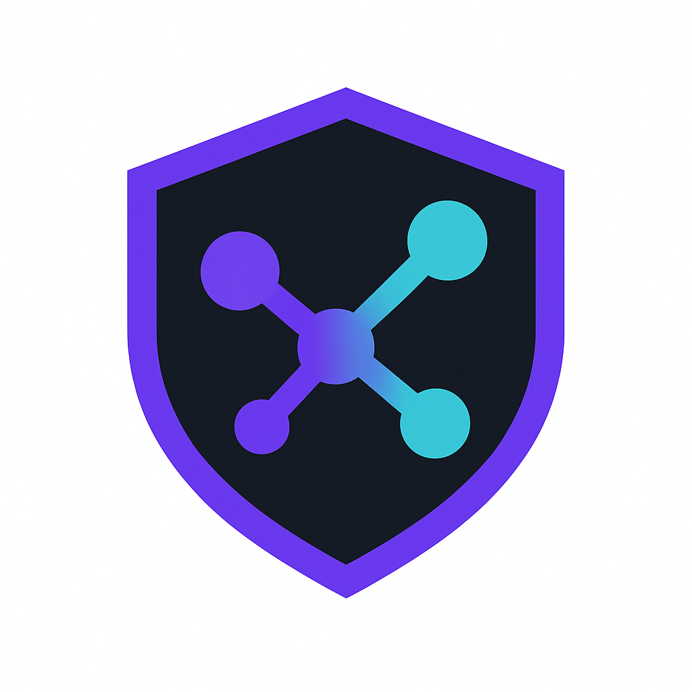
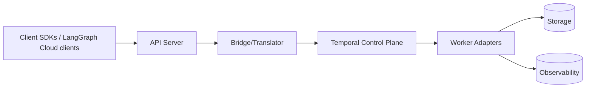

# DuraGraph



**An open, extensible orchestration layer for AI and workflow automation**

DuraGraph provides a **LangGraph Cloud-compatible API** built on top of **Temporal** for reliable, observable, and maintainable AI pipelines that can be self-hosted in enterprise environments.

## 🎯 Mission

Enable reliable, observable, and maintainable AI pipelines that feel natural for developers—bringing the power of LangGraph Cloud to self-hosted and enterprise environments with:

- **API Compatibility**: Drop-in replacement for LangGraph Cloud APIs
- **Enterprise Ready**: Self-hosted, compliant, secure
- **Fault Tolerant**: Built on Temporal for deterministic execution
- **Observable**: Rich monitoring and workflow introspection

## 🏗️ Architecture



### Components

- **API Server** (`cmd/api/`): LangGraph Cloud-compatible REST API
- **Runtime Bridge** (`runtime/bridge/`): Orchestrates workflow execution  
- **Translator** (`runtime/translator/`): Converts inputs to Temporal workflows
- **Go Worker** (`workers/go-adapter/`): Temporal worker for Go-based activities
- **Python Worker** (`workers/python-adapter/`): Temporal worker for Python-based activities
- **Dashboard** (`dashboard/`): Svelte-based workflow visualization
- **Website** (`website/`): Next.js landing page

## 🚀 Quick Start

### Prerequisites

- [Go 1.22+](https://golang.org/dl/)
- [Node.js 18+](https://nodejs.org/)
- [Python 3.11+](https://python.org/)
- [Docker & Docker Compose](https://docker.com/)
- [Task](https://taskfile.dev/) (recommended for development)

### Installation

```bash
# Clone the repository
git clone https://github.com/Duragraph/duragraph.git
cd duragraph

# Install Task (if not already installed)
# macOS
brew install go-task/tap/go-task
# or visit https://taskfile.dev/installation/

# Start all services
task up

# Or manually with Docker Compose
docker-compose up -d
```

### Development Setup

```bash
# Install all dependencies
task install

# Run individual components
task api:dev        # Start API server in development mode
task dashboard:dev  # Start Svelte dashboard
task website:dev    # Start Next.js website
task workers:go     # Start Go worker
task workers:python # Start Python worker

# Code generation
task codegen:list      # List available workflow examples
task codegen:eino      # Generate Go worker from Eino spec
task codegen:langgraph # Generate Python worker from LangGraph spec
task codegen:example   # Generate example workflows

# Run tests
task test          # Run all tests
task test:api      # Test Go API
task test:workers  # Test workers
task test:codegen  # Test code generation
task test:runtime  # Test runtime components
task lint          # Lint all code
```

## 📋 Development Tasks

We use [Task](https://taskfile.dev/) for development workflows. Run `task --list` to see all available tasks:

### Core Services
- `task up` - Start all services with Docker Compose
- `task down` - Stop all services
- `task api:dev` - Run API server in development mode
- `task dashboard:dev` - Run dashboard development server
- `task website:dev` - Run website development server

### Workers
- `task workers:go` - Start Go Temporal worker
- `task workers:python` - Start Python Temporal worker
- `task workers:dev` - Start all workers in development mode

### Testing & Quality
- `task test` - Run all tests
- `task test:api` - Test Go API and runtime components
- `task test:workers` - Test worker components
- `task lint` - Lint all codebases
- `task format` - Format all code

### Docker Operations
- `task docker:build` - Build all Docker images
- `task docker:api` - Build and run API Docker image
- `task docker:workers` - Build and run workers Docker images

## � **Code Generation Workflow**

DuraGraph converts user-defined workflows into Temporal-compatible code:

### **1. Define Your Workflow**
Write workflows in familiar frameworks:
- **Eino** (Go-based workflow definitions)
- **LangGraph** (Python-based workflow definitions)

### **2. Generate Temporal Workers**
```bash
# Generate from Eino specification
task codegen:eino INPUT=my-workflow.json OUTPUT=./generated/my-workflow

# Generate from LangGraph specification  
task codegen:langgraph INPUT=my-workflow.json OUTPUT=./generated/my-workflow
```

### **3. Deploy and Execute**
The API server bridges between LangGraph Cloud API and your generated Temporal workers:

```
User Request → API Server → Bridge → Temporal → Generated Workers → Results
```

## �🔧 API Usage

DuraGraph implements the LangGraph Cloud API. Here's a basic example:

### Create and Run a Workflow

```bash
# Create a run
curl -X POST http://localhost:8080/runs \
  -H "Content-Type: application/json" \
  -d '{
    "thread_id": "thread-123",
    "assistant_id": "assistant-456", 
    "input": "Hello, world!"
  }'

# Get run status
curl http://localhost:8080/runs/{run_id}

# Stream events (SSE)
curl http://localhost:8080/stream?run_id={run_id}
```

### Using with LangGraph SDK

```python
from langgraph_sdk import get_client

# Point to your DuraGraph instance
client = get_client(url="http://localhost:8080")

# Use exactly like LangGraph Cloud
assistant = await client.assistants.create(...)
thread = await client.threads.create()
run = await client.runs.create(thread_id=thread["id"], assistant_id=assistant["id"])
```

## 🗂️ Project Structure

```
duragraph/
├── cmd/api/                 # API server (Go)
├── runtime/
│   ├── bridge/              # Workflow orchestration bridge  
│   └── translator/          # IR to Temporal translation
├── workers/
│   ├── codegen/             # Code generation tools
│   │   ├── eino-to-temporal/      # Go: Eino → Temporal worker
│   │   ├── langgraph-to-temporal/ # Python: LangGraph → Temporal worker
│   │   └── duragraph-codegen      # CLI tool for code generation
│   ├── runtime/             # Generated worker runtime
│   │   ├── go-adapter/      # Temporal Go workers
│   │   └── python-adapter/  # Temporal Python workers
│   └── templates/           # Example workflow specifications
├── dashboard/               # Svelte visualization dashboard
├── website/                 # Next.js landing page
├── schemas/
│   ├── openapi/             # API specifications
│   └── ir/                  # Intermediate representation schemas
├── deploy/
│   ├── sql/                 # Database migrations
│   ├── compose/             # Docker Compose configs
│   └── helm/                # Kubernetes Helm charts
├── docs/                    # Documentation (MkDocs)
├── tests/                   # Test suites
└── Taskfile.yml             # Development task runner
```

## 🧪 Testing

### Unit Tests
```bash
task test:api      # Go API and runtime tests
task test:workers  # Worker component tests
task test:dashboard # Frontend tests
```

### Integration Tests  
```bash
task test:conformance  # LangGraph Cloud API conformance
task test:e2e         # End-to-end workflow tests
```

### Load Testing
```bash
task test:soak        # Long-running stability tests
```

## 🚢 Deployment

### Docker Compose (Development)
```bash
task up
```

### Kubernetes (Production)
```bash
# Coming soon - Helm charts in development
helm install duragraph ./deploy/helm/duragraph
```

### Configuration

Key environment variables:
- `TEMPORAL_HOSTPORT`: Temporal server address (default: `localhost:7233`)
- `NAMESPACE`: Temporal namespace (default: `default`)
- `DATABASE_URL`: PostgreSQL connection string
- `LOG_LEVEL`: Logging verbosity (default: `info`)

## 📚 Documentation

- **[Getting Started](docs/docs/getting-started.md)** - Setup and basic usage
- **[API Reference](docs/docs/api-reference/)** - Complete API documentation  
- **[Architecture](docs/docs/architecture/)** - System design and components
- **[Development Guide](docs/docs/development/)** - Contributing and development
- **[Operations](docs/docs/ops/)** - Deployment and monitoring

## 🤝 Contributing

1. Fork the repository
2. Create a feature branch: `git checkout -b feature/amazing-feature`
3. Make your changes and add tests
4. Run tests: `task test`
5. Lint code: `task lint`
6. Commit changes: `git commit -m 'Add amazing feature'`
7. Push to branch: `git push origin feature/amazing-feature`
8. Open a Pull Request

See [CONTRIBUTING.md](CONTRIBUTING.md) for detailed guidelines.

## 📄 License

Licensed under the [Apache License 2.0](LICENSE).

## 🙋‍♀️ Support

- **Documentation**: [docs/](docs/)
- **Issues**: [GitHub Issues](https://github.com/Duragraph/duragraph/issues)
- **Discussions**: [GitHub Discussions](https://github.com/Duragraph/duragraph/discussions)

## 🗺️ Roadmap

- [x] Basic API server and worker stubs
- [x] Svelte dashboard for graph visualization  
- [ ] Complete Temporal workflow integration
- [ ] LangGraph SDK code generation
- [ ] Production Helm charts
- [ ] Advanced observability and metrics
- [ ] Multi-tenant support

See [TODO.md](TODO.md) and [docs/roadmap.md](docs/roadmap.md) for detailed development status.

---

**DuraGraph** - Bringing enterprise-grade AI workflow orchestration to everyone.