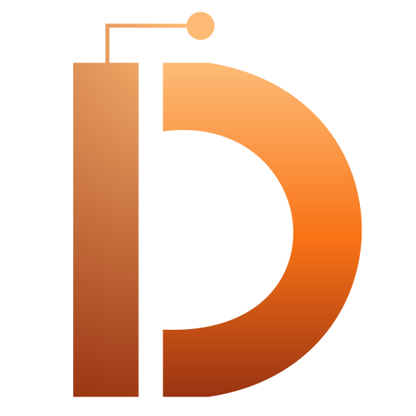
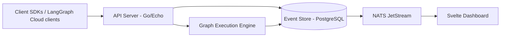

# DuraGraph



[](https://github.com/Duragraph/duragraph/actions/workflows/ci.yml)
[](https://github.com/Duragraph/duragraph/actions/workflows/duragraph.yml)
[](https://hub.docker.com/r/duragraph/duragraph)
[](https://hub.docker.com/r/duragraph/duragraph)
[](LICENSE)
[](go.mod)
[](https://goreportcard.com/report/github.com/Duragraph/duragraph)
[](https://github.com/Duragraph/duragraph/stargazers)

**An open, extensible orchestration layer for AI and workflow automation**

DuraGraph provides a **LangGraph Cloud-compatible API** built with **Event Sourcing** and **CQRS** patterns for reliable, observable, and maintainable AI pipelines that can be self-hosted in enterprise environments.

## 🎯 Mission

Enable reliable, observable, and maintainable AI pipelines that feel natural for developers—bringing the power of LangGraph Cloud to self-hosted and enterprise environments with:

- **API Compatibility**: Drop-in replacement for LangGraph Cloud APIs
- **Enterprise Ready**: Self-hosted, compliant, secure
- **Fault Tolerant**: Event sourcing with reliable event delivery via outbox pattern
- **Observable**: Rich monitoring and workflow introspection

## 🚀 Quick Start

Get started with DuraGraph in minutes:

**📖 [View Documentation](https://duragraph.ai/docs)** | **🎓 [Quick Start Guide](https://duragraph.ai/docs/introduction/)**

### One-Click Deploy

Deploy DuraGraph to your preferred cloud platform:

[](https://fly.io/docs/getting-started/)
[](https://render.com/deploy)
[](https://railway.app/template)
[](https://cloud.digitalocean.com/apps/new)
[](https://www.scaleway.com/en/docs/)

### Local Development

```bash
# Clone the repository
git clone https://github.com/Duragraph/duragraph.git
cd duragraph

# Start all services with Docker Compose
docker-compose up -d

# Or use Task
brew install go-task/tap/go-task
task up
```

Visit **http://localhost:8080** for the API and **http://localhost:5173** for the dashboard.

**👉 [Full Setup Guide](https://duragraph.ai/docs/user-guide/installation/self-hosted/)**

## 🏗️ Architecture


```mermaid
flowchart LR
  client["Client SDKs / LangGraph Cloud clients"]
  api[API Server - Go/Echo]
  eventstore[(Event Store - PostgreSQL)]
  nats[NATS JetStream]
  engine[Graph Execution Engine]
  dashboard[Svelte Dashboard]

  client --> api
  api --> eventstore
  api --> engine
  eventstore --> nats
  nats --> dashboard
  engine --> eventstore
```

**🔧 [Architecture Details](https://duragraph.ai/docs/architecture/overview/)**

## ⚡ Key Features

- 🔄 **LangGraph Cloud API Compatible** - Drop-in replacement for existing LangGraph Cloud integrations
- 🏢 **Self-Hosted** - Full control over your data and infrastructure
- ⚡ **Event Sourcing & CQRS** - Reliable, auditable workflow execution with event-driven architecture
- 🔍 **Observable** - Rich monitoring, tracing, and debugging tools with Prometheus metrics
- 🧩 **Extensible** - Custom graph execution engine with support for LLM nodes and tool execution
- 📊 **Visual Dashboard** - Real-time workflow visualization with Server-Sent Events
- 🐳 **Docker Ready** - Easy deployment with Docker Compose or Kubernetes

## 📚 Documentation

- **[Getting Started](https://duragraph.ai/docs/getting-started/)** - Installation and basic usage
- **[API Reference](https://duragraph.ai/docs/api-reference/overview/)** - Complete API documentation
- **[Architecture](https://duragraph.ai/docs/architecture/overview/)** - System design and components
- **[Development Guide](https://duragraph.ai/docs/development/building/)** - Contributing and development
- **[Deployment](https://duragraph.ai/docs/user-guide/installation/cloud/)** - Production deployment guides
- **[Operations](https://duragraph.ai/docs/ops/deployment/)** - Monitoring and maintenance

## 🔧 Basic Usage

```python
from langgraph_sdk import get_client

# Point to your DuraGraph instance
client = get_client(url="http://localhost:8080")

# Use exactly like LangGraph Cloud
assistant = await client.assistants.create(...)
thread = await client.threads.create()
run = await client.runs.create(
    thread_id=thread["id"],
    assistant_id=assistant["id"]
)
```

**📖 [Full API Documentation](https://duragraph.ai/docs/api-reference/rest-api/)**

## 🔌 LangGraph-Compatible API Endpoints

DuraGraph implements the full LangGraph Cloud API specification:

### System
| Method | Endpoint | Description |
|--------|----------|-------------|
| GET | `/ok` | Health check (returns `{"ok": true}`) |
| GET | `/info` | Server info (version, capabilities) |
| GET | `/health` | Detailed health status |

### Assistants
| Method | Endpoint | Description |
|--------|----------|-------------|
| POST | `/api/v1/assistants` | Create assistant |
| GET | `/api/v1/assistants` | List assistants |
| GET | `/api/v1/assistants/:id` | Get assistant |
| PATCH | `/api/v1/assistants/:id` | Update assistant |
| DELETE | `/api/v1/assistants/:id` | Delete assistant |
| POST | `/api/v1/assistants/search` | Search assistants |
| POST | `/api/v1/assistants/count` | Count assistants |
| POST | `/api/v1/assistants/:id/versions` | Create version |
| GET | `/api/v1/assistants/:id/versions` | List versions |
| GET | `/api/v1/assistants/:id/schemas` | Get schemas |

### Threads
| Method | Endpoint | Description |
|--------|----------|-------------|
| POST | `/api/v1/threads` | Create thread |
| GET | `/api/v1/threads` | List threads |
| GET | `/api/v1/threads/:id` | Get thread |
| PATCH | `/api/v1/threads/:id` | Update thread |
| DELETE | `/api/v1/threads/:id` | Delete thread |
| POST | `/api/v1/threads/search` | Search threads |
| POST | `/api/v1/threads/count` | Count threads |
| POST | `/api/v1/threads/:id/messages` | Add message |
| GET | `/api/v1/threads/:id/state` | Get state |
| POST | `/api/v1/threads/:id/state` | Update state |
| GET | `/api/v1/threads/:id/history` | Get history |
| POST | `/api/v1/threads/:id/copy` | Fork thread |

### Runs
| Method | Endpoint | Description |
|--------|----------|-------------|
| POST | `/api/v1/threads/:id/runs` | Create run |
| GET | `/api/v1/threads/:id/runs` | List runs |
| GET | `/api/v1/threads/:id/runs/:run_id` | Get run |
| POST | `/api/v1/threads/:id/runs/:run_id/cancel` | Cancel run |
| POST | `/api/v1/runs` | Create stateless run |
| POST | `/api/v1/runs/batch` | Batch create runs |
| POST | `/api/v1/runs/cancel` | Batch cancel runs |

### Streaming
| Method | Endpoint | Description |
|--------|----------|-------------|
| POST | `/api/v1/threads/:id/runs/stream` | Stream run events |
| GET | `/api/v1/threads/:id/runs/:run_id/stream` | Stream existing run |

## 🗂️ Project Structure

```
duragraph/
├── cmd/server/          # API server (Go)
├── internal/
│   ├── domain/          # Domain models (aggregates, entities, events)
│   ├── application/     # Use cases (commands, queries, services)
│   ├── infrastructure/  # External concerns (HTTP, persistence, messaging)
│   └── pkg/             # Shared utilities (errors, eventbus, uuid)
├── dashboard/           # Svelte visualization dashboard
├── website/             # Landing page (Vite/React)
├── docs/                # Documentation (Fumadocs/Next.js)
├── deploy/              # Docker, SQL migrations
└── Taskfile.yml         # Development task runner
```

## 🤝 Contributing

We welcome contributions! Please see our [Contributing Guide](CONTRIBUTING.md) for details.

1. Fork the repository
2. Create a feature branch: `git checkout -b feature/amazing-feature`
3. Make your changes and add tests
4. Run tests: `task test`
5. Open a Pull Request

**🛠️ [Development Guide](https://duragraph.ai/docs/development/building/)**

## 📄 License

Licensed under the [Apache License 2.0](LICENSE).

## 🙋 Support

- **Documentation**: [duragraph.ai/docs](https://duragraph.ai/docs)
- **Issues**: [GitHub Issues](https://github.com/Duragraph/duragraph/issues)
- **Discussions**: [GitHub Discussions](https://github.com/Duragraph/duragraph/discussions)

## 🗺️ Roadmap

- [x] LangGraph Cloud-compatible API
- [x] Event sourcing with CQRS pattern
- [x] Custom graph execution engine
- [x] Outbox pattern for reliable event delivery
- [x] PostgreSQL event store with NATS JetStream messaging
- [x] Fumadocs documentation site
- [x] Svelte dashboard for visualization
- [x] Server-Sent Events streaming
- [ ] Enhanced LLM provider support (additional models)
- [ ] Advanced workflow patterns (parallel execution, subgraphs)
- [ ] Production Helm charts
- [ ] Multi-tenant support
- [ ] Workflow versioning and migration tools

**📋 [Full Roadmap](https://duragraph.ai/docs/project/roadmap/)**

---

**DuraGraph** - Bringing enterprise-grade AI workflow orchestration to everyone.

**[Get Started](https://duragraph.ai/docs/getting-started/)** · **[Documentation](https://duragraph.ai/docs)** · **[Community](https://github.com/Duragraph/duragraph/discussions)**
