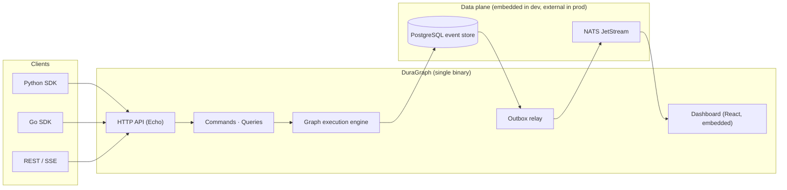

# DuraGraph


[](https://github.com/Duragraph/duragraph/actions/workflows/ci.yml)
[](https://github.com/Duragraph/duragraph/actions/workflows/duragraph.yml)
[](https://hub.docker.com/r/duragraph/duragraph)
[](https://hub.docker.com/r/duragraph/duragraph)
[](LICENSE)
[](go.mod)
[](https://github.com/Duragraph/duragraph/stargazers)

> **Temporal for AI agents.** Durable, replayable agent workflows — self-hosted, event-sourced, observable.

Agent workflows fail unpredictably: workers crash mid-tool-call, LLMs return junk, networks partition, runs hang for hours. DuraGraph treats every state transition as an event written to PostgreSQL in the same transaction as the work itself. Nothing is lost when a worker dies. Every run is replayable from its event log. Every node execution is observable in real time from the embedded dashboard.

## 60 seconds to a running agent

DuraGraph ships as a single binary with **embedded PostgreSQL and NATS**. No infrastructure to provision, no `docker compose up`.

### Install

```sh
# Homebrew (macOS, Linux)
brew install Duragraph/tap/duragraph

# One-line install script
curl -fsSL https://duragraph.ai/install.sh | sh

# From Go
go install github.com/Duragraph/duragraph/cmd/duragraph@latest

# Or grab a prebuilt binary
# → https://github.com/Duragraph/duragraph/releases
```

### Run

```sh
duragraph dev
# → Engine + dashboard on http://localhost:8081
# → Embedded Postgres + NATS, nothing to provision
```

### Run your first agent

Open **http://localhost:8081**, sign in with the bootstrap admin printed in the logs, head to **Playground**, pick a registered assistant, and send a message. You'll see the workflow execute live: each node lighting up as it runs, the full graph topology, and a replayable event log under **Traces**.

For a richer set of examples (RAG, tool-using agents, document processing, evals) browse [`examples/`](examples/) — both Go and Python references run against `duragraph dev` out of the box.

## What's in this repo

DuraGraph is a monorepo. The control plane, SDKs, dashboard, and docs all live here so they evolve together against a single spec.

| Path | What it is |
|------|------------|
| `cmd/duragraph` | The control-plane binary — engine, embedded dashboard, dev-mode bootstrapper |
| `internal/` | Domain / application / infrastructure layers (DDD + event sourcing + CQRS) |
| `dashboard/` | React + TanStack Router + xyflow dashboard, embedded in the binary at build time |
| `python/` | Python worker SDK (`duragraph` on PyPI) |
| `go-sdk/` | Go worker SDK |
| `studio/` | Visual workflow editor (alpha) |
| `docs/` | Astro Starlight documentation site |
| `examples/` | Reference agents in Go and Python |
| `deploy/` | Docker, SQL migrations, Helm charts |

## Why event sourcing

LangChain-class orchestrators store the *current* state of a run. When something goes wrong you get a stack trace and a vague last-known position. DuraGraph stores every state transition as an immutable event:

- **Crash-safe.** Worker crashes mid-tool-call? The event has already been persisted; on restart the engine resumes from the last committed state. No double-execution, no lost work.
- **Replayable.** Every run can be reconstructed from its event log. Debug a failure by stepping through the exact sequence of decisions that produced it.
- **Auditable.** Every change is timestamped, ordered, and signed by the aggregate version. Build evals and compliance views directly on the event store.
- **Decoupled streaming.** The outbox pattern relays domain events to NATS for SSE/dashboard updates without coupling write throughput to consumer health.

This is the same architecture Temporal uses for general-purpose durable workflows, applied to the specific shape of AI agent graphs: nodes, edges, conditional branches, human-in-the-loop interrupts, tool calls.

## Architecture


```mermaid
flowchart LR
  subgraph clients["Clients"]
    sdk_py["Python SDK"]
    sdk_go["Go SDK"]
    rest["REST / SSE"]
  end

  subgraph engine["DuraGraph (single binary)"]
    api["HTTP API (Echo)"]
    cqrs["Commands · Queries"]
    exec["Graph execution engine"]
    outbox["Outbox relay"]
    dash["Dashboard (React, embedded)"]
  end

  subgraph data["Data plane (embedded in dev, external in prod)"]
    pg[(PostgreSQL event store)]
    nats["NATS JetStream"]
  end

  sdk_py --> api
  sdk_go --> api
  rest --> api
  api --> cqrs --> exec
  exec --> pg
  pg --> outbox --> nats
  nats --> dash
```

Full architecture write-up: [duragraph.ai/docs/architecture](https://duragraph.ai/docs/architecture/overview/)

## API surface

DuraGraph speaks a stable REST + SSE API for runs, threads, assistants, and graphs. See the [API reference](https://duragraph.ai/docs/api-reference/rest-api/) for the full surface; the headline endpoints are:

```
POST   /api/v1/threads/:id/runs          # create a run
GET    /api/v1/runs/:id                  # fetch run state
GET    /api/v1/threads/:id/runs          # list a session's runs
GET    /api/v1/threads/:id/runs/:run_id/stream   # SSE: live execution events
POST   /api/v1/assistants                # register an assistant
GET    /api/v1/assistants/:id/graph      # introspect graph topology
```

Workers connect via the Python or Go SDK and register graph definitions on startup — no code-generation or DSL required.

## Status

What works today:

- Single-binary dev mode with embedded Postgres + NATS
- Event-sourced run aggregate with replay
- Outbox-relayed SSE streaming
- React dashboard: Playground, Threads, Assistants, Traces (session view), Runs
- Python and Go worker SDKs
- OpenTelemetry-friendly Prometheus metrics

In flight (see [`spec/roadmap.yml`](spec/roadmap.yml)):

- Per-node REST spans endpoint (currently SSE-only)
- Multi-tenant + NATS Accounts isolation
- Production Helm charts
- Workflow versioning and migrations

## Contributing

Pull requests welcome — see [CONTRIBUTING.md](CONTRIBUTING.md). The shortest path:

```sh
git clone https://github.com/Duragraph/duragraph.git
cd duragraph
task dev   # runs the engine + dashboard against a local Postgres + NATS
task test  # unit + integration suite
```

The spec is the source of truth — behavioural changes update [`spec/`](spec/) first, then the implementation. See [`CLAUDE.md`](CLAUDE.md) for the full development workflow.

## License

Apache 2.0 — see [LICENSE](LICENSE).

## Support

- Docs: [duragraph.ai/docs](https://duragraph.ai/docs)
- Issues: [GitHub Issues](https://github.com/Duragraph/duragraph/issues)
- Discussions: [GitHub Discussions](https://github.com/Duragraph/duragraph/discussions)
