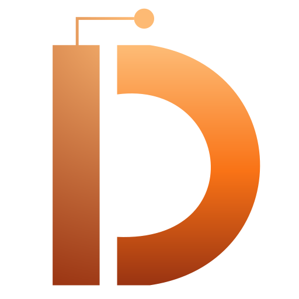
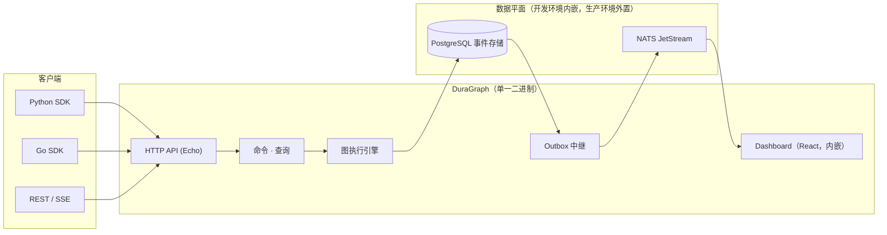

# DuraGraph

[English](README.md) · **简体中文**



[](https://github.com/Duragraph/duragraph/actions/workflows/ci.yml)
[](https://github.com/Duragraph/duragraph/actions/workflows/duragraph.yml)
[](https://hub.docker.com/r/duragraph/duragraph)
[](https://hub.docker.com/r/duragraph/duragraph)
[](LICENSE)
[](go.mod)
[](https://github.com/Duragraph/duragraph/stargazers)

> **面向 AI Agent 的 Temporal。** 持久、可重放的 Agent 工作流 —— 自托管、事件溯源、可观测。

Agent 工作流的失败方式难以预料：worker 在工具调用中途崩溃、LLM 返回垃圾内容、网络分区、任务挂起数小时。DuraGraph 把每一次状态变更都作为事件，与业务操作本身在同一个事务里写入 PostgreSQL。worker 挂掉时不会丢失任何数据，每一次运行都能从事件日志中重放，每一个节点的执行都能在内置的 Dashboard 中实时观测。

## 60 秒跑通一个 Agent

DuraGraph 以**内嵌 PostgreSQL 和 NATS** 的单一二进制文件分发。无需准备任何基础设施，也不需要 `docker compose up`。

### 安装

```sh
# Homebrew（macOS、Linux）
brew install Duragraph/tap/duragraph

# 一行安装脚本
curl -fsSL https://duragraph.ai/install.sh | sh

# 通过 Go 安装
go install github.com/Duragraph/duragraph/cmd/duragraph@latest

# 或者直接下载预编译二进制
# → https://github.com/Duragraph/duragraph/releases
```

### 运行

```sh
duragraph dev
# → 引擎 + Dashboard 运行在 http://localhost:8081
# → 内嵌 Postgres 与 NATS，无需额外部署
```

### 运行你的第一个 Agent

打开 **http://localhost:8081**，使用日志中打印的初始管理员账号登录，进入 **Playground**，选择一个已注册的 assistant 并发送消息。你会看到工作流实时执行：每个节点在运行时依次点亮、完整的图拓扑结构，以及 **Traces** 中可重放的事件日志。

想看更完整的示例（RAG、工具调用型 Agent、文档处理、评测），请浏览 [`examples/`](examples/) —— 其中的 Go 与 Python 参考实现都可以直接在 `duragraph dev` 上运行。

## 仓库结构

DuraGraph 是一个 monorepo。控制平面、SDK、Dashboard 和文档都放在这里，以便它们围绕同一份规范同步演进。

| 路径 | 说明 |
|------|------|
| `cmd/duragraph` | 控制平面二进制 —— 引擎、内嵌 Dashboard、dev 模式引导程序 |
| `internal/` | 领域层 / 应用层 / 基础设施层（DDD + 事件溯源 + CQRS） |
| `dashboard/` | React + TanStack Router + xyflow 实现的 Dashboard（含可视化工作流编辑器），在构建时嵌入二进制 |
| `python/` | Python worker SDK（PyPI 上的 `duragraph`） |
| `go-sdk/` | Go worker SDK |
| `docs/` | Astro Starlight 文档站点 |
| `examples/` | Go 与 Python 的参考 Agent 实现 |
| `deploy/` | Docker、SQL 迁移脚本、Helm charts |

## 为什么选择事件溯源

LangChain 这类编排框架保存的是一次运行的*当前*状态。出问题时你只能拿到一段堆栈信息和一个模糊的"最后已知位置"。DuraGraph 则把每一次状态变更都保存为不可变事件：

- **崩溃安全。** worker 在工具调用中途崩溃？事件已经完成持久化，重启后引擎会从最后提交的状态继续执行。不会重复执行，也不会丢失已完成的工作。
- **可重放。** 每一次运行都能从其事件日志完整重建。你可以逐步回放导致失败的完整决策序列来定位问题。
- **可审计。** 每一次变更都带有时间戳、顺序，并由聚合版本号标记。你可以直接基于事件存储构建评测与合规视图。
- **解耦的流式推送。** 通过 outbox 模式把领域事件中继到 NATS，用于 SSE / Dashboard 更新，从而让写入吞吐不受消费端健康状况的影响。

这与 Temporal 用于通用持久化工作流的架构一致，只是针对 AI Agent 图的具体形态做了适配：节点、边、条件分支、human-in-the-loop 中断、工具调用。

## 架构



完整架构说明：[duragraph.ai/docs/architecture](https://duragraph.ai/docs/architecture/overview/)

## API 概览

DuraGraph 为 runs、threads、assistants 和 graphs 提供稳定的 REST + SSE API。完整接口见 [API 参考文档](https://duragraph.ai/docs/api-reference/rest-api/)，其中核心端点如下：

```
POST   /api/v1/threads/:id/runs          # 创建一次运行
GET    /api/v1/runs/:id                  # 获取运行状态
GET    /api/v1/threads/:id/runs          # 列出某个会话的所有运行
GET    /api/v1/threads/:id/runs/:run_id/stream   # SSE：实时执行事件
POST   /api/v1/assistants                # 注册一个 assistant
GET    /api/v1/assistants/:id/graph      # 查看图拓扑结构
```

Worker 通过 Python 或 Go SDK 接入，并在启动时注册图定义 —— 无需代码生成，也没有额外的 DSL。

## 项目状态

当前已可用：

- 内嵌 Postgres + NATS 的单二进制 dev 模式
- 支持重放的事件溯源 run 聚合
- 基于 outbox 中继的 SSE 流式推送
- React Dashboard：Playground、Threads、Assistants、Traces（会话视图）、Runs
- Python 与 Go worker SDK
- 兼容 OpenTelemetry 的 Prometheus 指标

进行中：

- 按节点粒度的 REST spans 端点（目前仅支持 SSE）
- 多租户与 NATS Accounts 隔离
- 生产可用的 Helm charts
- 工作流版本管理与迁移

## 参与贡献

欢迎提交 Pull Request —— 详见 [CONTRIBUTING.md](CONTRIBUTING.md)（英文）。最快的上手路径：

```sh
git clone https://github.com/Duragraph/duragraph.git
cd duragraph
task dev   # 基于本地 Postgres + NATS 运行引擎与 Dashboard
task test  # 单元测试 + 集成测试
```

完整开发流程见 [`RUNBOOK.md`](RUNBOOK.md)（英文）。

## 许可证

Apache 2.0 —— 详见 [LICENSE](LICENSE)。

## 支持

- 文档：[duragraph.ai/docs](https://duragraph.ai/docs)
- 问题反馈：[GitHub Issues](https://github.com/Duragraph/duragraph/issues)
- 讨论：[GitHub Discussions](https://github.com/Duragraph/duragraph/discussions)
