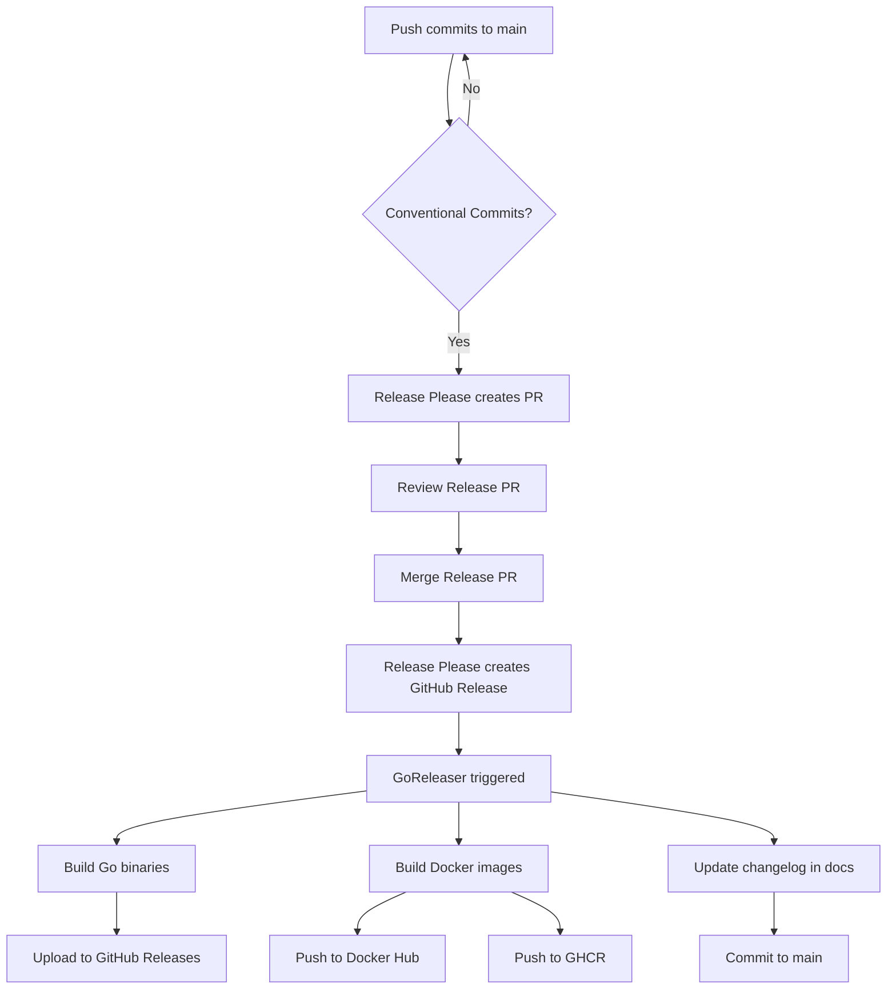

# DuraGraph Release Process

Complete guide to how releases work in DuraGraph.

## 🎯 Release Flow Overview



## 📝 Step-by-Step Process

### 1. Write Conventional Commits

Use these commit prefixes:

```bash
feat: add new feature       # → Minor version (1.0.0 → 1.1.0)
fix: fix bug                # → Patch version (1.0.0 → 1.0.1)
feat!: breaking change      # → Major version (1.0.0 → 2.0.0)
perf: improve performance   # → Patch version
docs: update documentation  # → No version bump
deps: update dependencies   # → Patch version
chore: maintenance          # → No version bump
```

**Example commits**:
```bash
git commit -m "feat: add streaming support for SSE"
git commit -m "fix: memory leak in event bus"
git commit -m "docs: update API reference"
git push origin main
```

### 2. Release Please Creates PR

After pushing to `main`, Release Please:
1. Analyzes commits since last release
2. Determines version bump (major/minor/patch)
3. Generates changelog
4. Creates a "Release PR" with:
   - Updated `CHANGELOG.md`
   - Version bump in files

**Example PR**:
```markdown
Title: chore(main): release 1.2.0

Changes:
- CHANGELOG.md: Added new features and fixes
- version.txt: 1.1.0 → 1.2.0
```

### 3. Review and Merge Release PR

**Review checklist**:
- ✅ Changelog is accurate
- ✅ Version bump is correct
- ✅ All tests pass (CI runs on PR)

**Merge the PR** → This triggers the actual release!

### 4. Automated Release Process

Once you merge the Release PR, the workflow automatically:

#### A. GoReleaser Builds Binaries
**Platforms built**:
- Linux (amd64, arm64, armv7)
- macOS (amd64, arm64)
- Windows (amd64)

**Output**:
- `duragraph_Linux_x86_64.tar.gz`
- `duragraph_Darwin_x86_64.tar.gz`
- `duragraph_Darwin_arm64.tar.gz` (Apple Silicon)
- `duragraph_Windows_x86_64.zip`
- And more...

#### B. Docker Images Published

**Docker Hub**:
```bash
duragraph/api:1.2.0       # Specific version
duragraph/api:1.2         # Minor version
duragraph/api:1           # Major version
duragraph/api:latest      # Latest release
```

**GitHub Container Registry**:
```bash
ghcr.io/duragraph/duragraph/api:1.2.0
ghcr.io/duragraph/duragraph/api:latest
```

**Multi-architecture**:
- `linux/amd64` (Intel/AMD)
- `linux/arm64` (ARM servers, Apple Silicon)

#### C. Changelog Updated in Docs

The workflow automatically:
1. Copies `CHANGELOG.md` to `docs/content/docs/changelog.mdx`
2. Adds frontmatter for Fumadocs
3. Updates version in `docs/lib/version.ts`
4. Commits changes back to `main`

#### D. GitHub Release Created

Release includes:
- 📝 **Changelog** (auto-generated)
- 📦 **Binary downloads** (all platforms)
- 🐳 **Docker instructions**
- 🔗 **Links to docs**

## 🏷️ Version Tagging

### Semantic Versioning

DuraGraph uses [Semantic Versioning](https://semver.org/):

```
v1.2.3
│ │ │
│ │ └─ Patch: Bug fixes, minor updates
│ └─── Minor: New features (backwards compatible)
└───── Major: Breaking changes
```

### How Versions are Determined

| Commit Type | Example | Version Change |
|-------------|---------|----------------|
| `feat:` | `feat: add WebSocket support` | 1.0.0 → 1.1.0 |
| `fix:` | `fix: memory leak` | 1.0.0 → 1.0.1 |
| `feat!:` | `feat!: redesign API` | 1.0.0 → 2.0.0 |
| `BREAKING CHANGE:` | In commit body | 1.0.0 → 2.0.0 |
| `perf:` | `perf: optimize queries` | 1.0.0 → 1.0.1 |
| `docs:` | `docs: update guide` | No change |
| `chore:` | `chore: update deps` | No change |

### Docker Tags

Each release creates multiple tags:

```bash
# Full version
duragraph/api:1.2.3

# Minor version (tracks latest patch)
duragraph/api:1.2  # → 1.2.3

# Major version (tracks latest minor)
duragraph/api:1    # → 1.2.3

# Latest (tracks latest release)
duragraph/api:latest  # → 1.2.3
```

**Users can choose stability vs. freshness**:
- `duragraph/api:1.2.3` - Pinned, never changes
- `duragraph/api:1.2` - Gets patch updates only
- `duragraph/api:1` - Gets all updates in v1
- `duragraph/api:latest` - Gets all updates (risky!)

## 🔧 Required GitHub Secrets

Add these in: **Settings → Secrets → Actions**

```bash
# Docker Hub (for public Docker images)
DOCKER_USERNAME=your-dockerhub-username
DOCKER_PASSWORD=your-dockerhub-token  # Generate at hub.docker.com

# GITHUB_TOKEN is automatic (for GHCR and GitHub Releases)
```

## 🚀 Manual Release (Emergency)

If you need to create a release manually:

```bash
# Create and push tag
git tag v1.2.3
git push origin v1.2.3

# GoReleaser runs automatically on tag push
```

Or trigger manually:

```bash
# Install GoReleaser locally
brew install goreleaser/tap/goreleaser

# Create release locally
goreleaser release --clean

# Or just build (no publish)
goreleaser build --snapshot --clean
```

## 📊 Release Checklist

Before merging Release PR:

- [ ] All CI checks pass
- [ ] Conformance tests pass
- [ ] Changelog is accurate
- [ ] Version bump is correct (major/minor/patch)
- [ ] Breaking changes documented (if major bump)
- [ ] Docker Hub credentials are set
- [ ] All tests pass locally

After release:

- [ ] Verify binaries on GitHub Releases page
- [ ] Test Docker image: `docker pull duragraph/api:TAG`
- [ ] Check changelog in docs: `https://duragraph.dev/docs/changelog`
- [ ] Announce in Discussions (optional)
- [ ] Update deployment docs if needed

## 🎨 Examples

### Feature Release (Minor)

```bash
# Commits
git commit -m "feat: add GraphQL API support"
git commit -m "feat: add rate limiting"
git commit -m "docs: update API guide"
git push origin main

# Result: 1.0.0 → 1.1.0
```

### Bug Fix Release (Patch)

```bash
# Commits
git commit -m "fix: race condition in event handler"
git commit -m "fix: memory leak in streaming"
git push origin main

# Result: 1.1.0 → 1.1.1
```

### Breaking Change Release (Major)

```bash
# Commit with BREAKING CHANGE
git commit -m "feat!: redesign authentication API

BREAKING CHANGE: Auth endpoints now use /v2/ prefix.
See migration guide in docs."
git push origin main

# Result: 1.1.0 → 2.0.0
```

## 🐛 Troubleshooting

### Release PR Not Created

**Cause**: No conventional commits since last release

**Solution**: Ensure commits use proper prefixes (`feat:`, `fix:`, etc.)

### GoReleaser Fails

**Cause**: Docker Hub credentials missing or invalid

**Solution**:
```bash
# Check secrets are set
gh secret list

# Set Docker Hub credentials
gh secret set DOCKER_USERNAME
gh secret set DOCKER_PASSWORD
```

### Docker Push Fails

**Cause**: Registry authentication issue

**Solution**: Regenerate Docker Hub token with read/write/delete permissions

### Changelog Not in Docs

**Cause**: `update-docs` job failed

**Solution**: Check workflow logs, manually copy CHANGELOG.md if needed

## 📚 Resources

- [Release Please](https://github.com/google-github-actions/release-please-action)
- [GoReleaser](https://goreleaser.com/)
- [Conventional Commits](https://www.conventionalcommits.org/)
- [Semantic Versioning](https://semver.org/)

---

**Questions?** Open a [GitHub Discussion](https://github.com/duragraph/duragraph/discussions)
