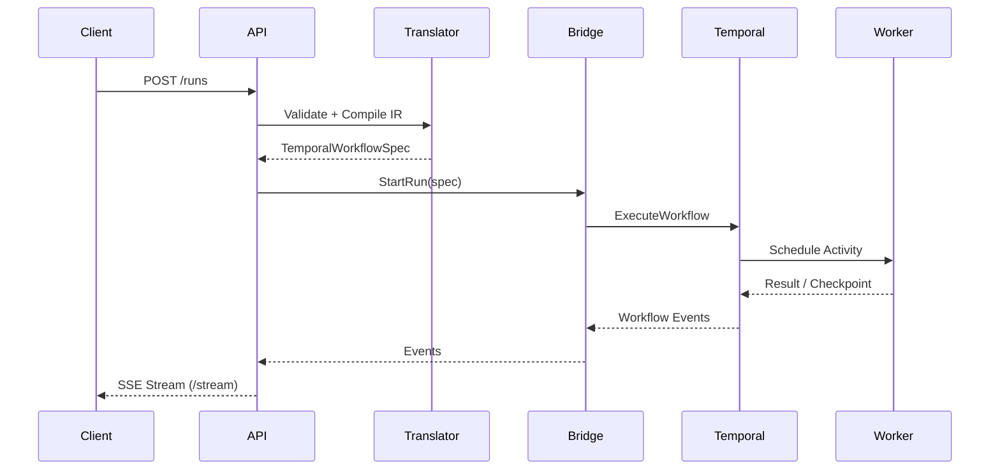

# Architecture Overview

This document provides a high-level overview of the components and data flows in the system.

---

## Components

- **API Service (`cmd/api`)**
  Exposes REST + SSE endpoints. Hosts the OpenAPI spec. Handles idempotency and error models.

- **Runtime Translator (`runtime/translator`)**
  Validates Intermediate Representation (IR) against JSON Schema and compiles it into a Temporal workflow spec.

- **Runtime Bridge (`runtime/bridge`)**
  Wraps the Temporal client. Provides APIs for starting, signaling, querying, and canceling runs. Executes generic workflows and activities.

- **Workers**
  Language-specific (Python, Go) adapters that execute activities such as LLM calls, tools, checkpoints, and token streaming.

- **Storage Backends**
  Integration with Postgres and S3 for persisting checkpoints, logs, and workflow states.

- **Temporal Cluster**
  Manages workflow execution, retries, signals, versioning, and search attributes.

---

## Data Flows

1. **Client** calls API (`create run`).
2. **API** validates request and forwards IR to `translator`.
3. **Translator** compiles IR into a Temporal workflow spec.
4. **Bridge** submits workflow to Temporal with search attributes.
5. **Temporal** schedules Activities on Workers.
6. **Workers** execute activities (LLM/tool/etc.), stream tokens if needed, and checkpoint state to Postgres/S3.
7. **Client** consumes updates through `/stream` SSE endpoint.

---

## Sequence Diagram (Mermaid)

---
