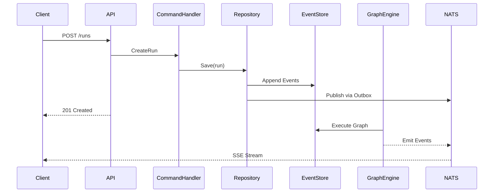

This document provides a high-level overview of the components and data flows in DuraGraph.

---

## Components

- **API Server (`cmd/server`)**
  Exposes REST + SSE endpoints. Implements LangGraph Cloud-compatible API. Handles request validation and error responses.

- **Command Handlers (`internal/application/command`)**
  Process write operations following CQRS. Create and modify domain aggregates, emitting domain events.

- **Query Handlers (`internal/application/query`)**
  Process read operations. Query projections directly for optimized reads.

- **Graph Engine (`internal/infrastructure/graph`)**
  Executes workflow graphs with support for conditionals, loops, subgraphs, and human-in-the-loop interrupts.

- **Event Store (`internal/infrastructure/persistence`)**
  PostgreSQL-based event sourcing. Stores all domain events for audit and state reconstruction.

- **NATS JetStream (`internal/infrastructure/messaging`)**
  Reliable event streaming via the outbox pattern. Publishes domain events for real-time updates.

- **Projections**
  Read-optimized views of domain state. Updated from events for fast queries.

---

## Data Flows

1. **Client** calls API (e.g., `POST /runs`).
2. **API** validates request and invokes command handler.
3. **Command Handler** creates/modifies aggregate, emitting domain events.
4. **Repository** saves events to event store + outbox in single transaction.
5. **Outbox Relay** publishes events to NATS JetStream.
6. **Graph Engine** executes workflow nodes (LLM, tools, conditions).
7. **Client** receives real-time updates via SSE stream.

---

## Sequence Diagram

---
