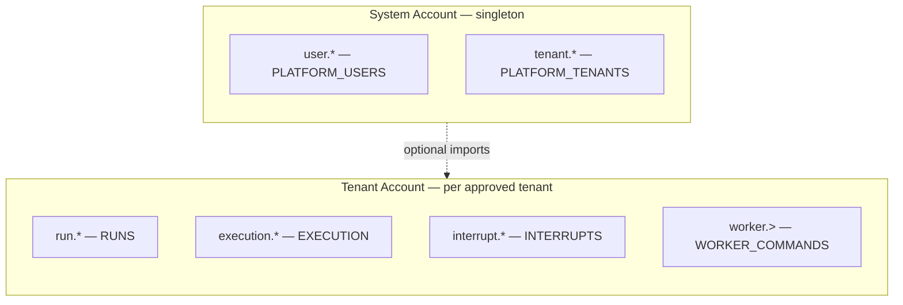
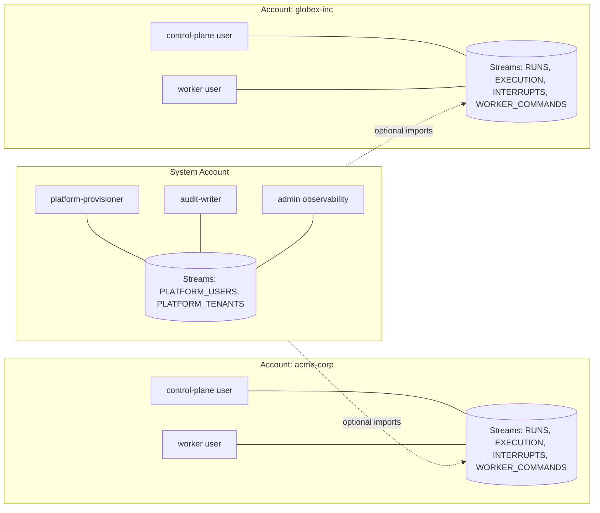
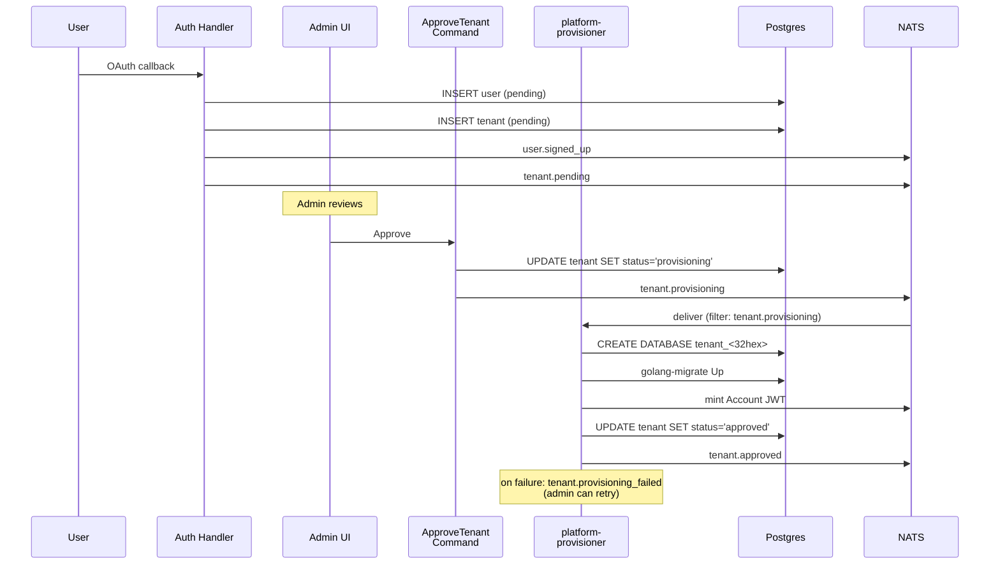

DuraGraph's runtime is event-driven. Every cross-process boundary — control plane to workers, workers back to the control plane, platform onboarding workflows, audit logging, real-time client streaming — is an event published to NATS JetStream.

This page describes the live event taxonomy. The [REST API](/docs/api-reference) tells you what clients can call; the events on this page tell you how the system actually breathes between processes.

---

## The five domains

The async surface is partitioned into five domains. Each has its own subject prefix, a dedicated JetStream stream, and a retention policy chosen for its workload.

| Domain                | Subjects      | Stream             | Retention      | Reason                                                |
| --------------------- | ------------- | ------------------ | -------------- | ----------------------------------------------------- |
| **Run lifecycle**     | `run.*`       | `RUNS`             | 7d / 1 GB      | Debuggable for a week; SSE late-joiners can replay    |
| **Node execution**    | `execution.*` | `EXECUTION`        | 24h / 500 MB   | Very high volume; live streaming + same-day forensics |
| **Human-in-the-loop** | `interrupt.*` | `INTERRUPTS`       | 7d / 100 MB    | Pending interrupts may wait days for a human          |
| **Worker commands**   | `worker.>`    | `WORKER_COMMANDS`  | WorkQueue / 1h | Each command consumed by exactly one worker           |
| **Platform users**    | `user.*`      | `PLATFORM_USERS`   | 30d / 256 MB   | Sparse but compliance-critical                        |
| **Platform tenants**  | `tenant.*`    | `PLATFORM_TENANTS` | 30d / 256 MB   | Provisioning workflow must survive restarts           |

**Retention policies in one line:**

- `limits` — keep until age or size cap; fan-out to multiple consumers.
- `workqueue` — delete on first ack; exactly one consumer.

---

## Multi-tenant isolation: NATS Accounts

This is the single most important architectural decision in the spec.

**The problem.** In a SaaS deployment, tenants share a NATS cluster. If `tenantA` could subscribe to `tenantB`'s `run.completed`, that's a data leak. Subject-prefix conventions like `tenant_{id}.run.created` are not a security boundary — anyone with access to the NATS connection can `SUB >`.

**The solution.** Use **NATS Accounts** in operator-JWT mode. Each approved tenant gets its own Account, minted dynamically at approval time (no NATS server restart). Within an Account, subjects stay short and unprefixed (`run.created`, `execution.node_started`). The Account boundary is the security boundary.

All three accounts live under one NATS Operator. Subjects are unprefixed inside each account; cross-account access requires explicit imports.

### Why operator-JWT mode

Accounts can be minted **without restarting the server**. Provisioning a new tenant signs a new Account JWT and pushes it to NATS. Compare with config-file Accounts, which would require redeploys for every signup.

### Why every payload still carries `tenant_id`

Defense in depth, plus practical needs:

1. The System Account imports per-tenant streams for cross-tenant admin queries — it must attribute imported events.
2. Postgres projections that span tenants need the foreign key.
3. The audit log must attribute every event regardless of NATS context.

The Account boundary prevents leaks; `tenant_id` lets authorized observers correctly slice the data they're allowed to see.

---

## Run domain (`run.*`)

Lifecycle events for the [Run aggregate](/docs/architecture/components#run-aggregate). Published by the control plane after the corresponding domain method is called and saved (events go through the [outbox](/docs/architecture/data-flow#outbox-pattern)).

| Channel               | Emitted when                         | Required payload                                                             |
| --------------------- | ------------------------------------ | ---------------------------------------------------------------------------- |
| `run.created`         | New run accepted                     | `tenant_id`, `run_id`, `thread_id`, `assistant_id`, `occurred_at`            |
| `run.started`         | `Run.Start()` (queued → running)     | `tenant_id`, `run_id`, `occurred_at`                                         |
| `run.completed`       | `Run.Complete(output)`               | `tenant_id`, `run_id`, `output`, `occurred_at`                               |
| `run.failed`          | `Run.Fail(err)`                      | `tenant_id`, `run_id`, `error`, `occurred_at`                                |
| `run.cancelled`       | `Run.Cancel(reason)`                 | `tenant_id`, `run_id`, `reason`, `occurred_at`                               |
| `run.requires_action` | `Run.RequiresAction(...)`            | `tenant_id`, `run_id`, `interrupt_id`, `reason`, `tool_calls`, `occurred_at` |
| `run.resumed`         | `Run.Resume(...)` after human action | `tenant_id`, `run_id`, `interrupt_id`, `tool_outputs`, `occurred_at`         |

`reason` on `run.requires_action` is one of: `tool_call`, `approval_required`, `input_needed`.

These map 1:1 to the Run aggregate's domain events. The mapping is what the [outbox relay](/docs/architecture/data-flow#outbox-pattern) implements.

---

## Execution domain (`execution.*`)

Per-node events. Emitted by whoever is executing the graph: the local engine if no worker is available, otherwise a worker process posting back via `/workers/{id}/events`, which the control plane re-emits onto the bus.

| Channel                    | Emitted when              | Required payload                                                                      |
| -------------------------- | ------------------------- | ------------------------------------------------------------------------------------- |
| `execution.node_started`   | Before each node executes | `tenant_id`, `run_id`, `node_id`, `node_type`, `occurred_at`                          |
| `execution.node_completed` | After each node returns   | `tenant_id`, `run_id`, `node_id`, `node_type`, `duration_ms`, `output`, `occurred_at` |
| `execution.node_failed`    | When a node throws        | `tenant_id`, `run_id`, `node_id`, `node_type`, `error`, `occurred_at`                 |

`node_type` is one of: `start`, `end`, `llm`, `tool`, `conditional`.

The 24h retention reflects this stream's volume — node events fire many times per run. They drive live SSE streams and same-day debugging, not long-term audit.

---

## Interrupt domain (`interrupt.*`)

Human-in-the-loop events. Used by dashboards waiting on approvals and notification systems alerting humans.

| Channel              | Emitted when                     | Required payload                                                                                 |
| -------------------- | -------------------------------- | ------------------------------------------------------------------------------------------------ |
| `interrupt.created`  | `humanloop.NewInterrupt` saved   | `tenant_id`, `interrupt_id`, `run_id`, `node_id`, `reason`, `state`, `tool_calls`, `occurred_at` |
| `interrupt.resolved` | `Interrupt.Resolve(toolOutputs)` | `tenant_id`, `interrupt_id`, `run_id`, `tool_outputs`, `occurred_at`                             |

---

## Worker commands (`worker.>`)

The command-pattern half of the bus. Unlike past-tense events above, these are imperative commands consumed from a `WorkQueue` stream — exactly one worker handles each.

| Channel                | Consumer         | `ack_wait` | Purpose                                 |
| ---------------------- | ---------------- | ---------- | --------------------------------------- |
| `worker.graph.execute` | `graph-executor` | 5 min      | Execute a whole graph end-to-end        |
| `worker.llm.invoke`    | `llm-worker`     | 2 min      | Single LLM call (fine-grained dispatch) |
| `worker.tool.execute`  | `tool-worker`    | 1 min      | Single tool execution                   |

`ack_wait` is sized to the longest legitimate processing time. All three consumers use `ack_policy: explicit` and `max_deliver: 3`.

:::note[Spec ahead of implementation]
The current Go implementation dispatches at the **run** level — the control plane sends one task per run and the worker drives the whole graph. The `worker.llm.invoke` and `worker.tool.execute` channels represent the v1.0-platform target where the control plane can dispatch individual node-level work to specialized worker pools. The contract is in place; the wiring is in flight.
:::

---

## Platform domain (`user.*`, `tenant.*`)

The SaaS onboarding flow. Lives in the System Account, not in any tenant Account. Admin consumers and the audit-log writer subscribe here.

### User lifecycle (`user.*`)

| Channel                  | Emitted when                                     |
| ------------------------ | ------------------------------------------------ |
| `user.signed_up`         | OAuth callback succeeds for the first time       |
| `user.promoted_to_admin` | User's role set to `admin` (bootstrap or manual) |
| `user.approved`          | Admin approves a pending user                    |
| `user.rejected`          | Admin rejects a pending user                     |
| `user.suspended`         | Admin suspends a previously-approved user        |

Schema quirk: `user.promoted_to_admin.promoted_by_user_id` is **field-absent** (not JSON `null`) in the bootstrap case — there is no human actor when the first user auto-elevates. Consumers must treat absence as the bootstrap signal.

### Tenant lifecycle (`tenant.*`)

| Channel                      | Emitted when                                           |
| ---------------------------- | ------------------------------------------------------ |
| `tenant.pending`             | Tenant row created at signup time, awaiting approval   |
| `tenant.provisioning`        | Admin clicks Approve — kicks off the async workflow    |
| `tenant.approved`            | Provisioning completed successfully (terminal success) |
| `tenant.provisioning_failed` | Any provisioning step failed; admin can retry          |
| `tenant.suspended`           | Admin suspends a tenant; API access gated off          |

### Provisioning workflow

Subtle but important: `tenant.approved` is published by the **provisioner consumer**, not by the `ApproveTenant` command handler. The command handler only emits `tenant.provisioning`; the success event is the _terminal_ event of the async workflow. This separation makes retries safe — the admin re-publishing `tenant.provisioning` will not double-create resources because only the consumer ever emits `tenant.approved`.

---

## Streams and consumers

### JetStream streams

| Stream             | Subjects      | Retention     | Max age      | Storage |
| ------------------ | ------------- | ------------- | ------------ | ------- |
| `RUNS`             | `run.*`       | limits        | 7d / 1 GB    | file    |
| `EXECUTION`        | `execution.*` | limits        | 24h / 500 MB | file    |
| `INTERRUPTS`       | `interrupt.*` | limits        | 7d / 100 MB  | file    |
| `WORKER_COMMANDS`  | `worker.>`    | **workqueue** | 1h           | file    |
| `PLATFORM_USERS`   | `user.*`      | limits        | 30d / 256 MB | file    |
| `PLATFORM_TENANTS` | `tenant.*`    | limits        | 30d / 256 MB | file    |

### Durable consumers

| Consumer                 | Stream             | Filter                 | `ack_wait` | `max_deliver` |
| ------------------------ | ------------------ | ---------------------- | ---------- | ------------- |
| `run-processor`          | `RUNS`             | —                      | 30 s       | 3             |
| `execution-tracker`      | `EXECUTION`        | —                      | —          | —             |
| `graph-executor`         | `WORKER_COMMANDS`  | `worker.graph.execute` | 5 m        | 3             |
| `llm-worker`             | `WORKER_COMMANDS`  | `worker.llm.invoke`    | 2 m        | 3             |
| `tool-worker`            | `WORKER_COMMANDS`  | `worker.tool.execute`  | 1 m        | 3             |
| `platform-audit-users`   | `PLATFORM_USERS`   | —                      | 30 s       | 3             |
| `platform-audit-tenants` | `PLATFORM_TENANTS` | —                      | 30 s       | 3             |
| `platform-provisioner`   | `PLATFORM_TENANTS` | `tenant.provisioning`  | 5 m        | 3             |

All consumers use `ack_policy: explicit` and `deliver_policy: all`.

---

## Delivery guarantees

- **At-least-once** delivery on every stream. Consumers must be idempotent.
- **Per-subject ordering** is preserved. Cross-subject ordering is not guaranteed.
- **Explicit ack** — messages stay in the stream until ACKed; redelivery after `ack_wait`.
- **`max_deliver: 3`** — after three failures the message is parked. In production, attach a DLQ stream.

For `worker.graph.execute` specifically, idempotency is enforced at the database layer: `task_assignments.claimed_by` uses `FOR UPDATE SKIP LOCKED` so a redelivered task whose row is already claimed becomes a no-op claim.

---

## Operations (publisher / subscriber map)

AsyncAPI 3.0 separates **channels** (named conduits) from **operations** (who does what to them). The spec defines explicit operations for every publish and subscribe:

| Operation                       | Action  | Channel                    | Actor                   |
| ------------------------------- | ------- | -------------------------- | ----------------------- |
| `publishRunCreated`             | send    | `run.created`              | API server              |
| `publishNodeCompleted`          | send    | `execution.node_completed` | Worker                  |
| `executeGraph`                  | send    | `worker.graph.execute`     | Control plane           |
| `publishUserSignedUp`           | send    | `user.signed_up`           | Auth handler            |
| `publishTenantProvisioning`     | send    | `tenant.provisioning`      | `ApproveTenant` command |
| `publishTenantApproved`         | send    | `tenant.approved`          | Provisioner (terminal)  |
| `subscribePlatformAuditUsers`   | receive | `user.signed_up`           | Audit writer            |
| `subscribePlatformAuditTenants` | receive | `tenant.approved`          | Audit writer            |
| `subscribePlatformProvisioner`  | receive | `tenant.provisioning`      | Provisioner             |

:::note[AsyncAPI 3.0 quirk]
An operation binds to **exactly one channel**. The audit-log writer subscribes to `user.*` _and_ `tenant.*` in reality, but in the spec it appears as two separate operations (`subscribePlatformAuditUsers`, `subscribePlatformAuditTenants`) because each operation must point at one channel. The underlying durable consumers attach to streams via filter subjects.
:::

---

## How this maps to the codebase

The contract is in the spec; the wiring is in the Go and Python implementations.

| Spec concept                    | Code location                                                    |
| ------------------------------- | ---------------------------------------------------------------- |
| `run.*` event payloads          | `duragraph/internal/domain/run/events.go`                        |
| Outbox → NATS bridge            | `duragraph/internal/infrastructure/messaging/outbox_relay.go`    |
| Worker command publishing       | `duragraph/internal/infrastructure/messaging/nats/task_queue.go` |
| `execution.*` emission (worker) | `duragraph-python/src/duragraph/worker/worker.py`                |
| Stream-to-SSE bridge            | `duragraph/internal/infrastructure/streaming/bridge.go`          |

---

## Resources

- [Data Flow](/docs/architecture/data-flow) — Event sourcing, CQRS, outbox internals
- [Components](/docs/architecture/components) — Run aggregate, event store, graph engine
- [Architecture Overview](/docs/architecture/overview) — Horizontal scaling and concurrency
- [Security Model](/docs/architecture/security-model) — Auth, rate limiting, threat model
