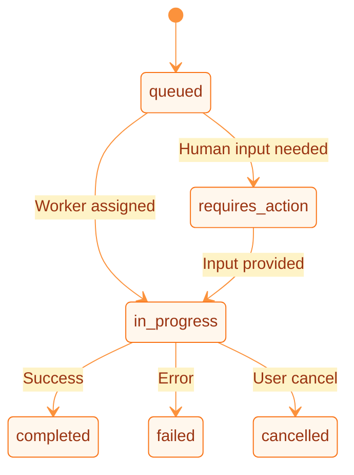

DuraGraph is built with Domain-Driven Design, separating concerns into domain, application, and infrastructure layers.

---

## Server Architecture

```
cmd/server/              → Entry point, middleware wiring, graceful shutdown
internal/
├── domain/              → Pure domain logic (no external dependencies)
│   ├── run/             → Run aggregate (workflow execution lifecycle)
│   ├── workflow/        → Workflow aggregate (assistants, threads, graphs)
│   ├── execution/       → Execution domain (nodes, state transitions)
│   └── worker/          → Worker domain (registration, heartbeats)
├── application/         → Use cases, orchestrating domain + infra
│   ├── command/         → Write operations (CreateRun, AssignWorker, etc.)
│   ├── query/           → Read operations (GetRun, ListThreads, etc.)
│   └── service/         → Cross-aggregate domain services
└── infrastructure/      → External concerns
    ├── http/            → REST handlers, middleware (rate limiting, auth, CORS)
    ├── persistence/     → PostgreSQL repositories, event store, outbox
    ├── messaging/       → NATS publisher/subscriber
    ├── graph/           → Graph execution engine
    ├── llm/             → LLM provider clients (OpenAI, Anthropic)
    ├── streaming/       → SSE stream management
    └── monitoring/      → Prometheus metrics
```

---

## API Server

The API server (`cmd/server/main.go`) is an [Echo](https://echo.labstack.com/) HTTP server that exposes a LangGraph Cloud-compatible REST API.

**Middleware chain** (applied in order):

1. **CORS** — Configurable cross-origin resource sharing
2. **Rate Limiting** — Token bucket per IP/user, opt-in via `RATE_LIMIT_ENABLED` env var
3. **Authentication** — JWT validation, opt-in via `AUTH_ENABLED` env var
4. **Request logging** — Structured request/response logging

**Key endpoints:**

| Endpoint               | Method   | Purpose                                          |
| ---------------------- | -------- | ------------------------------------------------ |
| `/health`              | GET      | Health check (excluded from rate limiting)       |
| `/metrics`             | GET      | Prometheus metrics (excluded from rate limiting) |
| `/api/v1/runs`         | POST     | Create a new run                                 |
| `/api/v1/runs/:run_id` | GET      | Get run status                                   |
| `/api/v1/assistants`   | POST/GET | Manage assistants                                |
| `/api/v1/threads`      | POST/GET | Manage threads                                   |
| `/api/v1/stream`       | GET      | SSE stream for real-time updates                 |

---

## Run Aggregate

The Run is the central domain aggregate, representing a single workflow execution. It follows a strict state machine:



**Key fields:**

- `version` — Optimistic concurrency control. Incremented on every update. Prevents lost updates in multi-instance deployments.
- `leaseEpoch` — Fencing token for worker assignments. Incremented on `AssignToWorker()` and `IncrementRetry()`. Prevents stale workers from completing reassigned tasks.

**Domain events emitted:**

`RunCreated`, `RunStarted`, `RunCompleted`, `RunFailed`, `RunCancelled`, `RunRequiresAction`

---

## Event Store

All state changes are persisted as immutable events in the `events` table. Events are the source of truth — projections and read models are derived from them.

```sql
CREATE TABLE events (
    id          BIGSERIAL PRIMARY KEY,
    aggregate_id UUID NOT NULL,
    event_type  TEXT NOT NULL,
    payload     JSONB NOT NULL,
    version     INT NOT NULL,
    created_at  TIMESTAMPTZ NOT NULL DEFAULT NOW()
);
```

Aggregates are reconstructed by replaying events in order. This enables:

- Complete audit trails for compliance
- Point-in-time state reconstruction
- Event-driven projections for read models

---

## Outbox Pattern

Events are published reliably using the transactional outbox pattern:

1. Domain events are written to both the `events` table and the `outbox` table in a single database transaction.
2. An outbox relay goroutine polls the `outbox` table and publishes events to NATS JetStream.
3. Published events are marked as delivered and cleaned up periodically.

The outbox relay uses `FOR UPDATE SKIP LOCKED` to allow multiple instances to process the outbox concurrently without conflicts.

---

## Graph Engine

The graph engine (`internal/infrastructure/graph`) executes workflow graphs defined by assistants. It supports:

- **Sequential execution** — Nodes execute in defined order
- **Conditional routing** — Router nodes direct flow based on state
- **Loops** — Cycles in the graph for iterative workflows
- **Human-in-the-loop** — Pause execution for human approval
- **Node types** — LLM calls, tool execution, DSPy modules, custom logic

---

## Rate Limiting

Three rate limiting strategies are available:

| Strategy                | Backend                | Use Case                                     |
| ----------------------- | ---------------------- | -------------------------------------------- |
| `SimpleRateLimit`       | In-memory token bucket | Single-instance or default                   |
| `RedisRateLimit`        | Redis sliding window   | Multi-instance deployments                   |
| `TieredRateLimitSimple` | Redis per-tier         | Role-based rate limits (free/pro/enterprise) |

All strategies:

- Skip `/health`, `/metrics`, and `/ok` endpoints
- Return standard headers: `X-RateLimit-Limit`, `X-RateLimit-Remaining`, `Retry-After`
- Key by authenticated `user_id` when available, falling back to client IP

---

## Resources

- [Architecture Overview](/docs/architecture/overview) — System design and scaling
- [Data Flow](/docs/architecture/data-flow) — Event sourcing and CQRS patterns
- [Deployment](/docs/ops/deployment) — Production configuration
