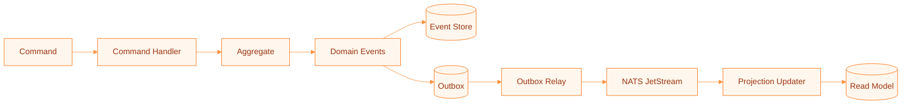
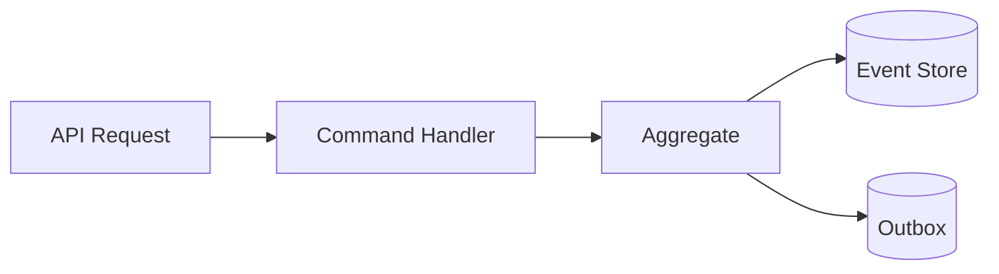
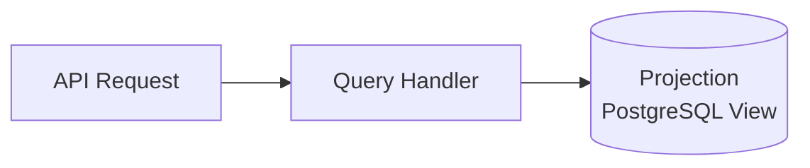

DuraGraph uses Event Sourcing and CQRS as its foundational data flow patterns. All state changes are captured as immutable events, and reads are served from optimized projections.

---

## Event Sourcing

Every mutation in DuraGraph produces one or more domain events. These events are the authoritative record of what happened — the current state of any aggregate is derived by replaying its events.



### Event lifecycle

1. A **command** (e.g., `CreateRun`) arrives via the API.
2. The **command handler** loads the aggregate by replaying its events from the event store.
3. The aggregate validates the command and produces **new domain events**.
4. Events are written to the **event store** and **outbox** in a single database transaction.
5. The **outbox relay** publishes events to NATS JetStream.
6. **Projection updaters** consume events and update read-optimized views.

### Domain events

| Event               | Trigger                         |
| ------------------- | ------------------------------- |
| `RunCreated`        | New run requested via API       |
| `RunStarted`        | Worker begins execution         |
| `RunCompleted`      | Workflow finished successfully  |
| `RunFailed`         | Workflow encountered an error   |
| `RunCancelled`      | User or system canceled the run |
| `RunRequiresAction` | Human-in-the-loop pause         |

Events are immutable and append-only. They are never modified or deleted.

---

## CQRS (Command Query Responsibility Segregation)

Writes and reads follow separate paths:

### Write path (Commands)



- Commands modify domain aggregates through domain methods.
- Aggregates enforce business rules and invariants.
- State changes are persisted as events, not as direct row updates.
- Optimistic concurrency control prevents lost updates (see [Horizontal Scaling](/docs/architecture/overview#horizontal-scaling)).

### Read path (Queries)



- Queries read directly from projection tables — never from the event store.
- Projections are denormalized for fast reads.
- Eventually consistent with the write path (typically milliseconds).

---

## Outbox Pattern

The outbox pattern ensures reliable event delivery to NATS JetStream, even if the message broker is temporarily unavailable.

### How it works

1. Within the same database transaction that writes events:
   ```sql
   INSERT INTO events (...) VALUES (...);
   INSERT INTO outbox (event_id, topic, payload) VALUES (...);
   ```
2. An outbox relay goroutine polls for unpublished messages:
   ```sql
   SELECT * FROM outbox WHERE NOT published
   ORDER BY created_at
   FOR UPDATE SKIP LOCKED
   LIMIT 100
   ```
3. Messages are published to NATS and marked as delivered.
4. A cleanup worker removes delivered messages older than 7 days.

### Multi-instance safety

`FOR UPDATE SKIP LOCKED` allows multiple server instances to process the outbox concurrently. Each instance grabs a non-overlapping batch of messages, preventing duplicate delivery.

---

## Optimistic Concurrency

DuraGraph uses optimistic concurrency control to prevent lost updates when multiple server instances attempt to modify the same aggregate simultaneously.

Every run aggregate carries a `version` column:

```sql
UPDATE runs
SET ..., version = $new_version
WHERE id = $id AND version = $expected_version
```

If the version has changed since the aggregate was loaded (another instance modified it), the update affects zero rows and the operation fails with a concurrency conflict. The caller can retry with a fresh read.

---

## Lease Epoch Fencing

Worker task assignments use a `lease_epoch` fencing token to prevent stale workers from completing tasks that have been reassigned.

1. When a run is assigned to a worker, the `lease_epoch` is incremented.
2. The worker receives the current epoch with the task assignment.
3. When the worker reports completion, it must present the correct epoch.
4. If the epoch doesn't match (task was reassigned), the completion is rejected.

This is critical for correctness in distributed deployments where workers may become temporarily unresponsive and tasks are reassigned to healthy workers.

---

## Real-Time Updates (SSE)

Clients subscribe to Server-Sent Events streams to receive real-time updates:

```
GET /api/v1/stream?run_id={id}
```

The SSE flow:

1. Graph engine emits events during execution.
2. Events are published to NATS JetStream.
3. The SSE handler subscribes to the relevant NATS subject.
4. Events are forwarded to the client as SSE messages.

Each run gets a dedicated NATS topic for isolation. Subscriptions are cleaned up when the client disconnects.

---

## Database Schema

Four migration stages define the schema:

| Migration                    | Purpose                                            |
| ---------------------------- | -------------------------------------------------- |
| `001_init.sql`               | Core projection tables (runs, threads, assistants) |
| `002_event_store.sql`        | Event sourcing tables (events, aggregate tracking) |
| `003_outbox.sql`             | Outbox pattern with publication triggers           |
| `004_projections.sql`        | Read model projections                             |
| `010_horizontal_scaling.sql` | Adds `version` and `lease_epoch` columns to runs   |

---

## Resources

- [Architecture Overview](/docs/architecture/overview) — Components and horizontal scaling
- [Components](/docs/architecture/components) — Detailed component descriptions
- [Deployment](/docs/ops/deployment) — Production configuration
