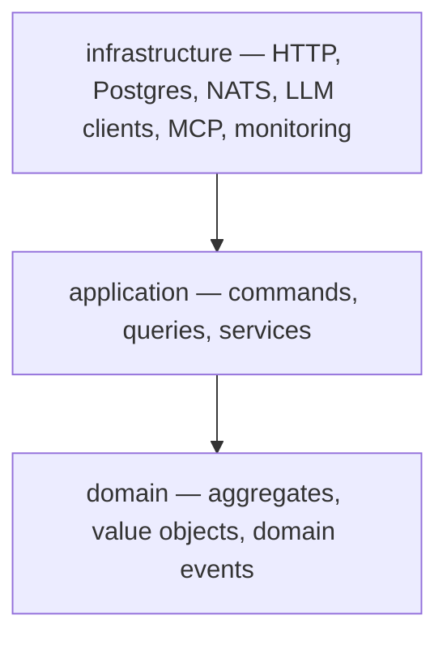

DuraGraph's control plane is built with **Domain-Driven Design**. Every piece of code lives in one of three layers, with strict rules about which layer can depend on which. This page explains the layers, the patterns, and the reasons.

If you have not yet, read [Components](/docs/architecture/components) for the file-tree view and [Data Flow](/docs/architecture/data-flow) for how events move through the system. This page focuses on the architectural _style_ itself.

---

## The three layers



The arrows show **dependency direction**. Each arrow means "imports from." `infrastructure` knows about `application` and `domain`. `application` knows about `domain`. `domain` knows about nothing.

| Layer              | Lives in                   | Imports allowed                     | Imports forbidden                                    |
| ------------------ | -------------------------- | ----------------------------------- | ---------------------------------------------------- |
| **domain**         | `internal/domain/`         | Standard library, `internal/pkg/`   | `pgx`, `nats`, `echo`, anything in `infrastructure/` |
| **application**    | `internal/application/`    | `domain`, `internal/pkg/`           | `pgx`, `nats`, `echo` directly                       |
| **infrastructure** | `internal/infrastructure/` | All of the above + external clients | —                                                    |

The composition root — `cmd/server/main.go` — is the only file that imports from all three. That is where everything gets wired together.

---

## Why this dependency rule exists

It enforces three properties that matter for long-term maintenance:

1. **Domain logic is testable without mocks.** A `Run` aggregate has no Postgres or NATS dependency, so its unit test does not need a database fixture or a fake message broker. You can run the entire `internal/domain/run/` test suite in milliseconds.
2. **Infrastructure is swappable.** The Postgres `RunRepository` implements an interface declared in the domain. If we move to a different database, the swap is contained — domain code does not change.
3. **Business rules cannot leak.** A junior engineer fixing a bug in an HTTP handler cannot accidentally bypass an aggregate invariant by writing to the database directly. The handler does not have a database connection — it only has command and query handlers.

---

## The domain layer

The domain layer holds three kinds of things:

- **Aggregates** — clusters of objects treated as a single unit for the purpose of state changes. Each aggregate has a root (e.g. `Run`) that is the only externally addressable object.
- **Value objects** — immutable types with no identity (e.g. `Status`, `RunID`).
- **Domain events** — past-tense facts about state changes (e.g. `RunCreated`, `RunCompleted`).

### Aggregate boundaries

Each subdirectory under `internal/domain/` is one aggregate:

| Aggregate     | Responsibility                                             |
| ------------- | ---------------------------------------------------------- |
| `run/`        | Workflow execution lifecycle (queued → running → terminal) |
| `workflow/`   | Assistants, threads, graphs                                |
| `execution/`  | Per-node state and events                                  |
| `humanloop/`  | Human-in-the-loop interrupts                               |
| `worker/`     | Worker registration and task assignments                   |
| `checkpoint/` | Thread-state checkpoints (LangGraph parity)                |

Aggregates do not call each other directly. If a use case spans multiple aggregates, an [application service](#application-services) coordinates them.

### Aggregates enforce invariants

The `Run` aggregate is the canonical example. Its public methods are not setters — they are state transitions that emit events:

```go
// internal/domain/run/run.go
func (r *Run) Complete(output map[string]interface{}) error {
    if !r.status.CanTransitionTo(StatusCompleted) {
        return errors.InvalidState(r.status.String(), "complete")
    }
    now := time.Now()
    r.status = StatusCompleted
    r.output = output
    r.completedAt = &now
    r.updatedAt = now
    r.recordEvent(RunCompleted{RunID: r.id, Output: output, OccurredAt: now})
    return nil
}
```

Three things to notice:

1. **The state machine is in the domain.** `Status.CanTransitionTo(...)` decides what is legal. An HTTP handler cannot bypass it because it does not have access to `r.status =`.
2. **Events are recorded, not published.** The aggregate appends to its `events` slice. Whoever calls `repo.Save(r)` is responsible for persisting them.
3. **No infrastructure imports.** This file imports `time`, `errors`, and `eventbus` (an internal package that defines the `Event` interface). Nothing else.

For the full state machine, see [Components → Run Aggregate](/docs/architecture/components#run-aggregate).

### Domain events live with their aggregate

```
internal/domain/run/
├── run.go         → the aggregate itself
├── status.go      → Status value object + state machine
├── events.go      → RunCreated, RunStarted, RunCompleted, ...
└── repository.go  → Repository interface (no implementation)
```

The event types are typed Go structs, not generic maps. That means callers get compile-time checks on payload fields. The Postgres event store serializes them to JSONB at the boundary; the domain never sees JSON.

---

## Repositories: interface in domain, implementation in infrastructure

This is the clean split that lets the domain stay pure.

```go
// internal/domain/run/repository.go — interface declared in domain
type Repository interface {
    Save(ctx context.Context, run *Run) error
    FindByID(ctx context.Context, id string) (*Run, error)
    Update(ctx context.Context, run *Run) error
    FindActiveByThreadID(ctx context.Context, threadID string) ([]*Run, error)
    LoadFromEvents(ctx context.Context, id string) (*Run, error)
    // ...
}
```

```go
// internal/infrastructure/persistence/postgres/run_repository.go
type RunRepository struct {
    writePool  *pgxpool.Pool
    readPool   *pgxpool.Pool
    eventStore *EventStore
}

func (r *RunRepository) Save(ctx context.Context, runAgg *run.Run) error {
    // BEGIN TX
    // INSERT INTO runs (projection)
    // EventStore.SaveEventsInTx(...) — also INSERT INTO outbox via trigger
    // COMMIT
}
```

The application layer holds a `run.Repository`, never a `*postgres.RunRepository`. Tests use an in-memory implementation; production wires the Postgres one.

The `Save` method is responsible for **atomicity** — the projection update, the events, and the outbox row all happen in one transaction. See [Data Flow → Outbox Pattern](/docs/architecture/data-flow#outbox-pattern).

---

## The application layer

The application layer orchestrates aggregates. It does not contain business rules — those belong in the domain. It contains **use cases**: "create a run," "submit tool outputs," "list assistants for this thread."

Three flavors live here.

### Command handlers (writes)

One file per use case in `internal/application/command/`. Each defines a command struct and a handler:

```go
type CreateRun struct {
    ThreadID    string
    AssistantID string
    Input       map[string]interface{}
    // ...
}

type CreateRunHandler struct {
    runRepo run.Repository
}

func (h *CreateRunHandler) Handle(ctx context.Context, cmd CreateRun) (string, error) {
    runAgg, err := run.NewRun(cmd.ThreadID, cmd.AssistantID, cmd.Input, ...)
    if err != nil {
        return "", err
    }
    if err := h.runRepo.Save(ctx, runAgg); err != nil {
        return "", errors.Internal("failed to save run", err)
    }
    return runAgg.ID(), nil
}
```

**The handler is small on purpose.** It is a thin orchestrator: bind input, load or create an aggregate, call domain methods, save. Everything interesting happens inside the aggregate.

### Query handlers (reads)

In `internal/application/query/`. They read directly from projections and return DTOs — they do not load full aggregates.

```go
type GetRunHandler struct {
    runRepo run.Repository
}

func (h *GetRunHandler) Handle(ctx context.Context, runID string) (*RunDTO, error) {
    runAgg, err := h.runRepo.FindByID(ctx, runID)
    // ... map to DTO ...
}
```

This split is the C-Q in CQRS. See [Data Flow → CQRS](/docs/architecture/data-flow#cqrs-command-query-responsibility-segregation) for the rationale.

### Application services (multi-aggregate)

Some use cases touch more than one aggregate. They live in `internal/application/service/`:

| Service         | Coordinates                                                                                                            |
| --------------- | ---------------------------------------------------------------------------------------------------------------------- |
| `RunService`    | `Run` + `Workflow` (assistant/graph) + `Humanloop` (interrupts) — orchestrates `ExecuteRun`, `WaitForRun`, `CancelRun` |
| `WorkerService` | `Worker` + `Run` — dispatches runs to workers, reclaims expired leases                                                 |
| `CronScheduler` | Polls cron table, materializes runs                                                                                    |

Services are also where async behavior lives. `RunService.ExecuteRun` is what `RunHandler.CreateRun` spawns in a goroutine after returning 201 to the client.

---

## Why aggregates do not call repositories

A common mistake is to write `run.Save(repo)` — the aggregate calling the repository. DuraGraph deliberately avoids this. Aggregates know about the domain only; they record events, but they do not know how those events are stored.

Persistence is the application layer's job:

```
HTTP handler → CommandHandler → Aggregate.SomeMethod() → records events
                              → Repository.Save(aggregate) → persists events
```

This keeps the aggregate testable in isolation: a unit test can call `Run.Complete(out)` and assert on `Run.Events()` without ever touching a repository.

---

## Errors as a domain concept

The domain layer defines its own error type:

```go
// internal/pkg/errors/errors.go
type DomainError struct {
    Code    string
    Message string
    Wrapped error
    Details map[string]any
}

func NotFound(resource, id string) *DomainError
func InvalidInput(field, message string) *DomainError
func InvalidState(currentState, attemptedAction string) *DomainError
func Internal(message string, err error) *DomainError
```

The HTTP middleware in `internal/infrastructure/http/middleware/error.go` maps these to HTTP status codes:

| `DomainError.Code` | HTTP status |
| ------------------ | ----------- |
| `NOT_FOUND`        | 404         |
| `INVALID_INPUT`    | 400         |
| `INVALID_STATE`    | 409         |
| `INTERNAL`         | 500         |

The aggregate returns a `*DomainError` on illegal transitions. The handler does not need to know about HTTP status codes — the middleware translates at the boundary.

---

## What lives where: a quick scan

If you are looking for code that...

| Concern                                   | Open                                               |
| ----------------------------------------- | -------------------------------------------------- |
| Defines a state transition rule           | `internal/domain/<aggregate>/`                     |
| Validates "is this transition legal"      | The aggregate's status type (e.g. `run/status.go`) |
| Persists an aggregate                     | `internal/infrastructure/persistence/postgres/`    |
| Orchestrates a use case across aggregates | `internal/application/service/`                    |
| Handles an HTTP request                   | `internal/infrastructure/http/handlers/`           |
| Wires everything together                 | `cmd/server/main.go`                               |
| Defines an event payload                  | The aggregate's `events.go`                        |
| Maps a domain error to HTTP               | `internal/infrastructure/http/middleware/error.go` |

---

## How DDD interacts with the other patterns

DuraGraph layers DDD with three other patterns that reinforce it:

- **Event Sourcing** — aggregates emit events instead of mutating projections directly. The events are the source of truth. See [Data Flow](/docs/architecture/data-flow#event-sourcing).
- **CQRS** — write path goes through aggregates; read path queries projections. The two paths can scale independently.
- **Outbox** — aggregate events and outbox rows are written in one transaction; a relay publishes to NATS. See [Data Flow](/docs/architecture/data-flow#outbox-pattern).

The combination is not coincidental. Event Sourcing only works cleanly when aggregates are pure (DDD) and writes/reads are separated (CQRS). The outbox is what bridges the synchronous transaction boundary to the asynchronous bus.

---

## Resources

- [Components](/docs/architecture/components) — Folder layout and the Run aggregate's state machine
- [Data Flow](/docs/architecture/data-flow) — Event sourcing, CQRS, outbox
- [Architecture Overview](/docs/architecture/overview) — Horizontal scaling and concurrency
- [Async Event Architecture](/docs/architecture/async-events) — How domain events become NATS messages
