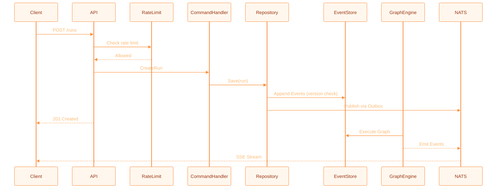

This document provides a high-level overview of the components and data flows in DuraGraph.

---

## Components

- **API Server (`cmd/server`)**
  Exposes REST + SSE endpoints. Implements LangGraph Cloud-compatible API. Handles request validation, rate limiting, and error responses.

- **Command Handlers (`internal/application/command`)**
  Process write operations following CQRS. Create and modify domain aggregates, emitting domain events.

- **Query Handlers (`internal/application/query`)**
  Process read operations. Query projections directly for optimized reads.

- **Graph Engine (`internal/infrastructure/graph`)**
  Executes workflow graphs with support for conditionals, loops, subgraphs, and human-in-the-loop interrupts.

- **Event Store (`internal/infrastructure/persistence`)**
  PostgreSQL-based event sourcing. Stores all domain events for audit and state reconstruction. Uses optimistic concurrency control with version columns.

- **NATS JetStream (`internal/infrastructure/messaging`)**
  Reliable event streaming via the outbox pattern. Publishes domain events for real-time updates.

- **Projections**
  Read-optimized views of domain state. Updated from events for fast queries.

- **Rate Limiting Middleware (`internal/infrastructure/http/middleware`)**
  Token bucket rate limiting per IP or authenticated user. Supports in-memory (SimpleRateLimit), Redis-based, and tiered strategies.

---

## Data Flows

1. **Client** calls API (e.g., `POST /runs`).
2. **API** validates request, applies rate limiting, and invokes command handler.
3. **Command Handler** creates/modifies aggregate, emitting domain events.
4. **Repository** saves events to event store + outbox in single transaction with optimistic concurrency check.
5. **Outbox Relay** publishes events to NATS JetStream (uses `FOR UPDATE SKIP LOCKED` for multi-instance safety).
6. **Graph Engine** executes workflow nodes (LLM, tools, DSPy modules, conditions).
7. **Client** receives real-time updates via SSE stream.

---

## Horizontal Scaling

DuraGraph supports multi-instance deployment using PostgreSQL primitives only — no external coordination services (etcd, ZooKeeper) required.

### Optimistic Concurrency Control

Every run aggregate carries a `version` column. Updates use optimistic locking:

```sql
UPDATE runs SET ..., version = version + 1
WHERE id = $1 AND version = $2
```

If another instance modified the run concurrently, the update affects zero rows and the operation is retried or fails with a concurrency conflict error.

### Lease Epoch Fencing

Worker task assignments carry a `lease_epoch` that increments on every assignment or retry. This prevents stale workers from processing tasks that have been reassigned — the worker must present the current epoch to complete the task.

### Advisory Locks for Singleton Jobs

Background jobs that must run on exactly one instance (e.g., lease expiry monitor) use PostgreSQL advisory locks:

```sql
SELECT pg_try_advisory_lock(42)
```

Only the instance that acquires the lock runs the job. Other instances skip it gracefully.

### Skip Locked for Concurrent Access

Outbox relay and expired lease scanning use `FOR UPDATE SKIP LOCKED` to allow multiple instances to process work concurrently without conflicts:

```sql
SELECT * FROM outbox WHERE NOT published
ORDER BY created_at
FOR UPDATE SKIP LOCKED
LIMIT 100
```

---

## Sequence Diagram



---
