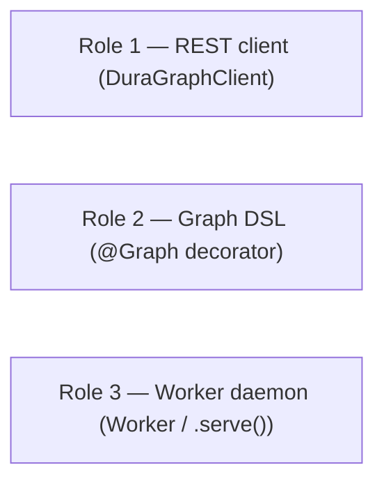
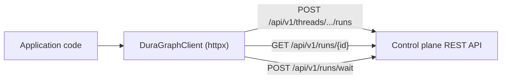
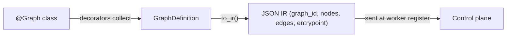
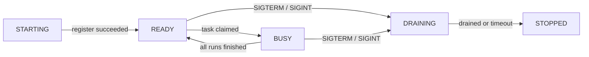
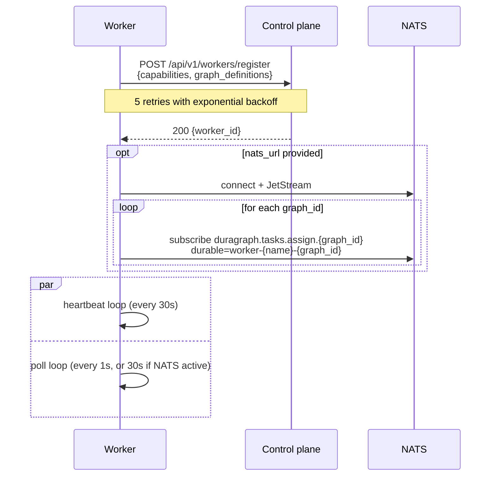
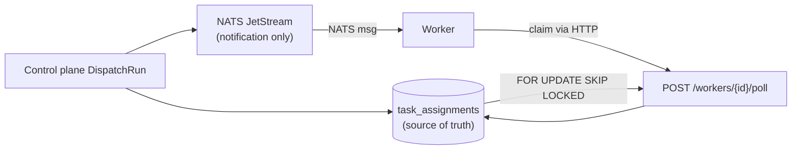
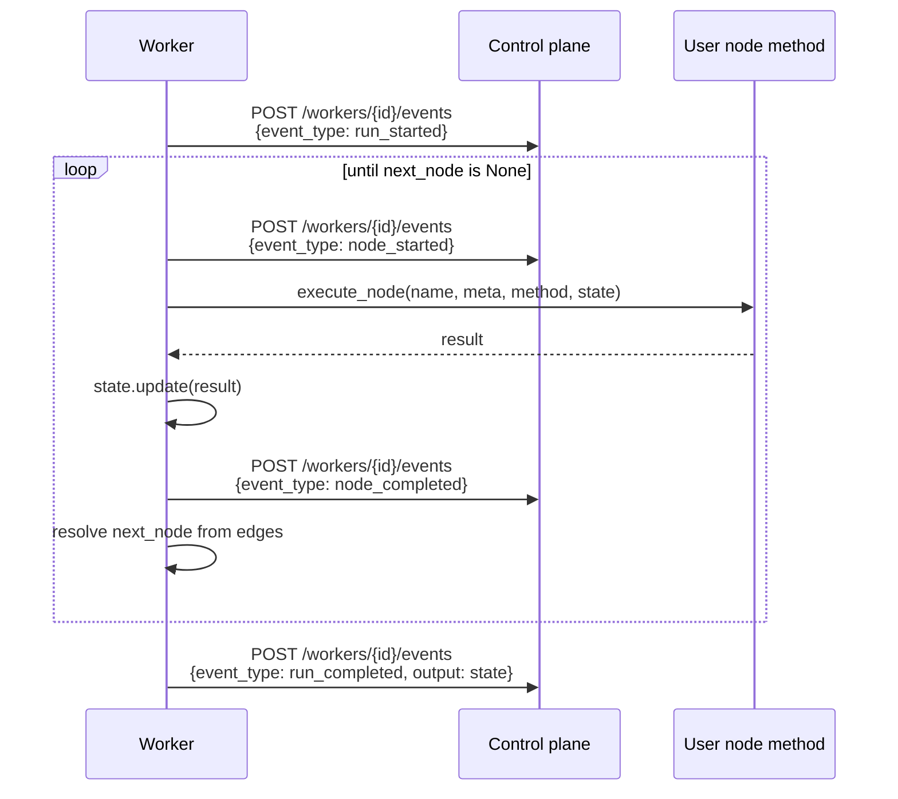
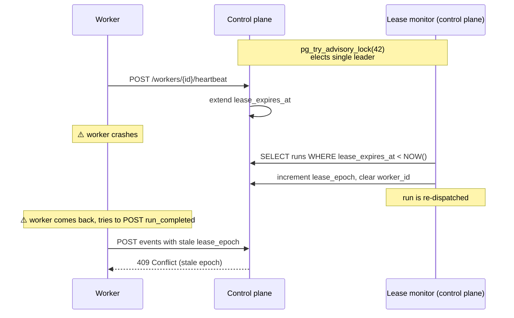
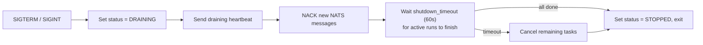
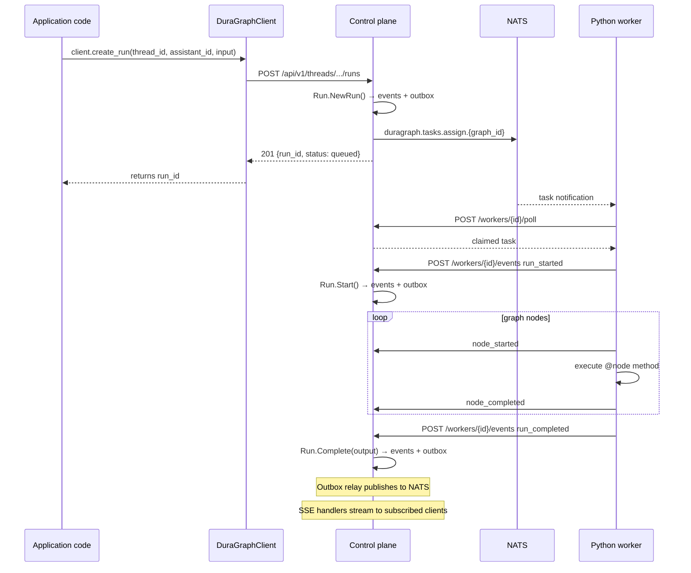

The Python SDK (`duragraph-python`) is one package that plays three different roles depending on how you import it. This page explains the internal architecture — what each module is for, how the worker connects to the control plane, and what guarantees hold across crashes and network hiccups.

For installation and the public API surface, see the [Python SDK reference](/docs/sdk/python). This page is about _how it works internally_.

---

## Three roles in one package



| Role          | When you use it                                               | What it talks to                                                    |
| ------------- | ------------------------------------------------------------- | ------------------------------------------------------------------- |
| **Client**    | Backend code or notebook creating assistants/threads/runs     | Control plane REST API                                              |
| **Graph DSL** | Author defines a workflow in Python with `@Graph` and `@node` | Compiled to JSON IR for the control plane                           |
| **Worker**    | Long-running Python process that _executes_ dispatched runs   | Control plane HTTP `/workers/*` endpoints + optional NATS JetStream |

A typical user installs `duragraph` once and uses all three: the `@Graph` decorator to define a workflow, `Worker.serve()` to host it, and `DuraGraphClient` to trigger runs.

---

## Module layout

```
src/duragraph/
├── __init__.py             → Re-exports public API
├── client.py               → DuraGraphClient + AsyncDuraGraphClient (httpx)
├── graph.py                → @Graph decorator, GraphDefinition, GraphInstance
├── nodes.py                → @entrypoint, @node, @llm_node, @tool_node, @router_node, @human_node
├── edges.py                → @edge decorator
├── executor.py             → execute_node() — calls user methods with state
├── tools.py                → Tool registry (mirrors Go-side built-ins)
├── types.py                → State, Message, StreamMode, RunResult, Event TypedDicts
├── worker/
│   └── worker.py           → Worker class — register/poll/heartbeat/drain
├── llm/                    → Optional: OpenAI, Anthropic clients
├── vectorstores/           → Optional: Qdrant, pgvector, Weaviate, Chroma, Pinecone
├── embeddings/             → Optional: OpenAI, Cohere, Anthropic, Ollama
└── document_loaders/       → Optional: text splitters, file/web loaders
```

The optional packages are imported lazily — installing `duragraph` without extras gives you the client + graph DSL + worker only. The optional dependencies are pulled in by extras (`pip install duragraph[llm,vectorstores]`).

---

## Role 1: `DuraGraphClient` — REST wrapper

`client.py` is a thin `httpx`-based wrapper over the control plane's REST API. Both sync (`DuraGraphClient`) and async (`AsyncDuraGraphClient`) variants exist; both implement context-manager protocols.



Method-to-endpoint mapping (selected):

| SDK method                                                   | Control plane endpoint                                     |
| ------------------------------------------------------------ | ---------------------------------------------------------- |
| `create_assistant` / `get` / `list` / `update` / `delete`    | `POST/GET/PATCH/DELETE /api/v1/assistants[...]`            |
| `create_thread` / `get_thread_state` / `update_thread_state` | `/api/v1/threads/...`                                      |
| `create_run`                                                 | `POST /api/v1/threads/:tid/runs` (returns 201 immediately) |
| `wait_for_run`                                               | `POST /api/v1/runs/wait` (blocks until terminal)           |
| `cancel_run`                                                 | `POST /api/v1/threads/:tid/runs/:rid/cancel`               |
| `put_store_item` / `get_store_item` / `search_store`         | `/api/v1/store/*` (LangGraph long-term memory)             |
| `create_cron` / `delete_cron` / `search_crons`               | `/api/v1/runs/crons[...]`                                  |

The client sets `X-Api-Key` if configured; the control plane's optional auth middleware accepts that or a JWT.

Errors are raised as `httpx.HTTPStatusError`. The control plane sends a structured `{error, message, code}` body which the application can parse.

---

## Role 2: Graph DSL — Python to IR

`graph.py`, `nodes.py`, and `edges.py` together form a small DSL. The author writes a normal Python class with decorated methods; the decorators collect metadata into a `GraphDefinition` object that knows how to serialize itself to the JSON IR the control plane stores.

```python
from duragraph import Graph, entrypoint, llm_node, tool_node, edge

@Graph(id="chatbot", version="1.0.0")
class Chatbot:
    @entrypoint
    @llm_node(model="claude-sonnet-4-6")
    def think(self, state): ...

    @tool_node(tools=["http_get"])
    def use_tool(self, state): ...

    @edge("think", "use_tool", when=lambda s: s.get("tool_call"))
    @edge("think", "__end__", when=lambda s: not s.get("tool_call"))
    def routes(self): ...
```

### What the decorators produce



```python
class GraphDefinition:
    graph_id: str
    nodes: dict[str, NodeMetadata]    # name → {type, config}
    edges: list[Edge]                 # source, target (str or dict for conditional)
    entrypoint: str | None

    def to_ir(self) -> dict:
        return {
            "version": "1.0",
            "graph": {
                "id": self.graph_id,
                "entrypoint": self.entrypoint,
                "nodes": [...],
                "edges": [...],
            },
        }
```

The IR is uploaded once during worker registration, in the `graph_definitions` field of the registration payload. Once stored, the control plane uses it to route dispatch — `WorkerService.FindForGraph(graphID)` only routes a run to a worker that previously declared support for that graph.

### Local execution mode

`GraphInstance.run()` also supports **local in-process execution**, with no control plane involved. This is useful for unit testing node logic. The same execution path (`executor.execute_node`) drives both local and worker-served runs, so behavior is identical.

---

## Role 3: Worker — the long-running side

`worker/worker.py` is a 600+ line `asyncio` daemon. The `@Graph` decorator's `.serve()` method wraps it for one-line use:

```python
chatbot = Chatbot()
chatbot.serve(
    control_plane_url="http://localhost:8081",
    worker_name="chatbot-worker-1",
    nats_url="nats://localhost:4222",  # optional; instant task delivery
)
```

### Worker lifecycle

The worker is a finite state machine. State transitions are driven by external events (control plane responses, signals) and internal conditions (active run count).



| State      | Behavior                                     | Heartbeat sends    |
| ---------- | -------------------------------------------- | ------------------ |
| `STARTING` | Connecting to control plane and NATS         | —                  |
| `READY`    | No active runs; accepting new tasks          | `status: ready`    |
| `BUSY`     | At least one run in flight                   | `status: busy`     |
| `DRAINING` | Refusing new tasks; finishing what's running | `status: draining` |
| `STOPPED`  | Final; worker exits                          | —                  |

### Startup sequence



### Two task delivery modes

The worker supports **NATS JetStream subscription** (instant) and **HTTP polling** (always available), and uses both at once when NATS is configured.



Critical detail: **even when a NATS notification arrives, the worker still calls `/poll` to claim the row in Postgres.** Postgres is the source of truth; NATS is just a wakeup. This means duplicate NATS deliveries are harmless — the second `/poll` finds nothing and returns. We get NATS's millisecond latency without sacrificing the correctness guarantees of a database transaction.

When `nats_url` is not provided, the worker polls `/workers/{id}/poll` every second by default. With NATS active, polling drops to every 30 seconds as a safety net.

### Per-run execution

When a worker claims a task, it walks the graph using its registered instance methods:



The control plane translates each `/events` call into a Run aggregate transition:

| Event from worker     | Aggregate method called                            |
| --------------------- | -------------------------------------------------- |
| `run_started`         | `Run.Start()`                                      |
| `node_started`        | (emits execution event; no aggregate state change) |
| `node_completed`      | (emits execution event)                            |
| `run_completed`       | `Run.Complete(output)`                             |
| `run_failed`          | `Run.Fail(error)`                                  |
| `run_requires_action` | `Run.RequiresAction(...)` (suspends; awaits human) |

The worker never writes to the database directly. All state changes go through the aggregate, which records [domain events](/docs/architecture/domain-driven-design#domain-events-live-with-their-aggregate) that the [outbox](/docs/architecture/data-flow#outbox-pattern) ships to NATS.

---

## Lease and fencing

The worker process holds a 2-minute lease on each task it claims. The lease is extended by heartbeats every 30 seconds. If the worker crashes or its network partitions, the lease expires and the control plane reclaims the task.



`lease_epoch` is a **fencing token**. Every time a lease is reclaimed, the control plane increments it. A zombie worker that comes back online and tries to finalize a run with the old epoch is rejected — the row's actual epoch has advanced.

This is the same pattern Martin Kleppmann calls out in _How to do distributed locking_ — Postgres acts as the lock authority.

For the control-plane side, see [Architecture Overview → Lease Epoch Fencing](/docs/architecture/overview#lease-epoch-fencing).

---

## Graceful shutdown

On `SIGTERM` or `SIGINT`, the worker enters `DRAINING`:



The control plane sees the `draining` heartbeat and stops dispatching new tasks to this worker — but it does not reclaim runs already in flight. Existing runs continue to completion as long as they finish within the shutdown window.

Hard kills (SIGKILL or process crash) skip the graceful path. The lease monitor takes over and reclaims after the lease expires.

---

## End-to-end: from `client.create_run` to a Python worker executing it



If the application also called `client.wait_for_run(...)`, that call is blocked on `POST /api/v1/runs/wait`, which the control plane resolves via NATS subscription on the run's events. When `run.completed` arrives, the call returns the final run with output.

---

## Where user code actually runs

A common point of confusion: when you use a worker, **the LLM calls, tool execution, and your `@node` methods all run in the Python process — not on the control plane.** The Go control plane never imports `openai` or `anthropic` for worker-served runs. The LLM clients in the Go codebase exist only for the local fallback engine, used when no worker is available.

This is a deliberate split:

| Concern                                       | Runs in                                                  |
| --------------------------------------------- | -------------------------------------------------------- |
| Run aggregate state, transitions, persistence | Go control plane                                         |
| Lease management, dispatch, fencing           | Go control plane                                         |
| Outbox relay, NATS publishing, SSE fan-out    | Go control plane                                         |
| `@node` method bodies                         | Python worker                                            |
| LLM API calls                                 | Python worker (via `llm/` modules)                       |
| Tool calls                                    | Python worker (via `tools.py` and user-registered tools) |
| Vector store queries                          | Python worker (via `vectorstores/`)                      |

The control plane owns durability; the worker owns user-defined behavior. The boundary is the `/workers/{id}/events` endpoint.

---

## How this maps to DDD

The Python SDK does not implement DDD itself — it is a client and a worker for the control plane that does. But it interacts with DDD-shaped boundaries:

- The worker's `POST /events` calls translate one-to-one to [Run aggregate methods](/docs/architecture/domain-driven-design#aggregates-enforce-invariants). The control plane validates state transitions before persisting.
- The IR uploaded at registration becomes the `Workflow` aggregate's graph data.
- The worker cannot bypass invariants — if it tries to send `run_completed` for a run that is `requires_action`, the aggregate's state machine rejects the transition and the call returns 409.

That is the value of strict aggregate boundaries: they hold even when the actor is in a different language, on a different host.

---

## Resources

- [Python SDK Reference](/docs/sdk/python) — Public API, decorators, examples
- [Domain-Driven Design](/docs/architecture/domain-driven-design) — Layers and aggregates on the Go side
- [Async Event Architecture](/docs/architecture/async-events) — NATS streams, accounts, channels
- [Components](/docs/architecture/components) — Run aggregate, event store, graph engine
- [Architecture Overview](/docs/architecture/overview) — Horizontal scaling and concurrency
