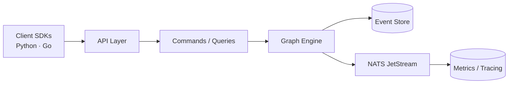

import { Badge } from '@astrojs/starlight/components';

<Badge text="v0.7.2" variant="success" /> <Badge text="Apache-2.0" variant="note" />

## What is DuraGraph?

DuraGraph is an **open-source control plane for AI workflows** — a self-hosted orchestration engine that runs multi-step agent pipelines with full observability, fault tolerance, and auditability.

Define workflows as graphs. Execute them reliably. Observe everything.

## Architecture

DuraGraph is built on **event sourcing** and **CQRS** — patterns proven in financial systems and distributed databases:

- **Event Sourcing** — Every state change is an immutable event. Replay any workflow execution from the first token to the last. Full audit trail by default.
- **CQRS** — Commands write events, queries read projections. Scale reads and writes independently.
- **Transactional Outbox** — Events are published to NATS JetStream via a transactional outbox, guaranteeing at-least-once delivery with no dual-write problems.
- **PostgreSQL** — Durable event store and read-model projections. No proprietary state stores.
- **NATS JetStream** — Reliable event streaming for worker coordination and real-time updates.
- **Custom Graph Engine** — Supports conditionals, loops, parallel execution, and human-in-the-loop patterns.

This architecture gives you **deterministic execution**, **point-in-time state reconstruction**, and **zero mutable state**.

## Who is DuraGraph For?

- **AI platform teams** building internal orchestration layers with strict reliability requirements.
- **Enterprises** that need compliance, audit trails, and data sovereignty for AI workflows.
- **Teams scaling AI agents** that have outgrown simple LLM chains and need production infrastructure.
- **Open-source contributors** looking for a well-architected orchestration stack to build on.

## What's Included

## Non-Goals

- Providing a custom LLM runtime (we integrate with existing providers — OpenAI, Anthropic, any HTTP-compatible model).
- Becoming a full-featured cloud platform (our scope is orchestration, not hosting).

## Success Metrics

We measure success by:

- **Reliability**: demonstrated ability to recover from failures without data loss.
- **Adoption**: number of teams running DuraGraph in production.
- **Community growth**: contributions and RFCs from external developers.
